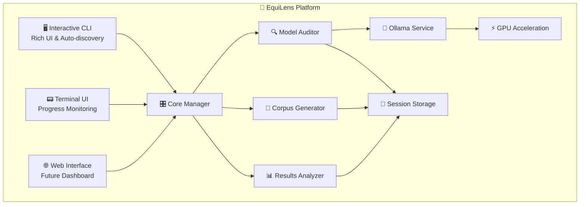

# 🎯 EquiLens - AI Bias Detection Platform

**Professional AI bias detection platform with interactive CLI, GPU acceleration, and comprehensive reporting**

| License                                                                         | Python                                                                    | Docker                                                                       | Platform                                                                                                             |
| ------------------------------------------------------------------------------- | ------------------------------------------------------------------------- | ---------------------------------------------------------------------------- | -------------------------------------------------------------------------------------------------------------------- |
| [](#license) | [](#requirements) | [](#docker-setup) | [](#compatibility) |

## 🌟 Key Features

- 🎨 **Interactive CLI** - Rich UI with auto-discovery and guided workflows
- ⚡ **GPU Acceleration** - NVIDIA CUDA support for 5-10x faster inference
- 🤖 **Multi-Model Support** - Ollama, Hugging Face, OpenAI integration
- 📊 **Comprehensive Analysis** - Statistical bias detection with visualizations
- 🐳 **Docker Integration** - Containerized deployment with GPU passthrough
- 📁 **Session Management** - Organized output with resumable workflows
- 🔧 **Professional UX** - Unicode-safe, cross-platform compatibility

## 🚀 Quick Start

### ✅ Setup Verification

```bash
# 🔍 Verify your setup (recommended first step)
python verify_setup.py

# The verification script checks:
# - Python version compatibility
# - Required packages installation
# - Directory structure integrity
# - Docker availability
# - Ollama connection
# - GPU support detection
# - System resources
```

### 🎯 One-Command Experience (Recommended)

```bash
# 🚀 Launch Interactive Interface
uv run equilens --help

# ✨ The CLI will:
# - Auto-discover corpus files and available models
# - Present beautiful selection panels with Rich UI
# - Guide you through the complete bias detection workflow
# - Save all results in organized session directories
```

### 🔧 Manual Setup

```bash
# 1. 📦 Environment Setup
uv venv
uv pip install -r pyproject.toml

# 2. 🐳 Start Services (Docker)
docker compose up -d

# 3. 🔍 Run Bias Audit
uv run python src/Phase2_ModelAuditor/audit_model.py \
  --model phi3:mini \
  --corpus src/Phase1_CorpusGenerator/corpus/audit_corpus_gender_bias.csv

# 4. 📊 Analyze Results
uv run python src/Phase3_Analysis/analyze_results.py \
  --results_file results/results_phi3_mini_*.csv
```

### 4. Platform Launchers (Auto-activates venv)
```bash
# Windows (double-click or command line)
equilens.bat gpu-check
equilens.bat start

# Linux/macOS
chmod +x equilens.sh
./equilens.sh gpu-check
./equilens.sh start
```

## 🎮 GPU Acceleration

EquiLens automatically detects and uses GPU acceleration when available:

- **🔍 Check GPU Status**: `python equilens.py gpu-check`
- **🎯 Auto-Detection**: GPU automatically used if CUDA + Docker GPU support available
- **⚡ CPU Fallback**: Seamless fallback to CPU-only mode
- **📋 Setup Guidance**: Direct links to NVIDIA CUDA downloads

**Performance Impact**: 5-10x faster model inference with GPU acceleration

```
./equilens.sh start
```

## 🏗️ Architecture

```
┌─────────────────┐    ┌──────────────────┐    ┌─────────────────┐
│   Host Machine  │───▶│   Docker Engine  │───▶│   Containers    │
│                 │    │                  │    │                 │
│ equilens.py     │    │ docker-compose   │    │ • Ollama        │
│ equilens.bat    │    │                  │    │ • EquiLens App  │
│ equilens.sh     │    │                  │    │                 │
└─────────────────┘    └──────────────────┘    └─────────────────┘
```

## 📋 Available Commands

| Command | Description | Example |
|---------|-------------|---------|
| `start` | Start all services | `python equilens.py start` |
| `stop` | Stop all services | `python equilens.py stop` |
| `status` | Show service status | `python equilens.py status` |
| `models list` | List available models | `python equilens.py models list` |
| `models pull <name>` | Download model | `python equilens.py models pull llama3.2` |
| `audit <config>` | Run bias audit | `python equilens.py audit config.json` |
| `generate <config>` | Generate test corpus | `python equilens.py generate config.json` |
| `analyze <results>` | Analyze results | `python equilens.py analyze results.csv` |

## 🎯 Key Features

### ✅ **Smart Ollama Detection**
- Automatically detects existing Ollama containers
- Uses external Ollama if available and accessible
- Creates new Ollama container only if needed
- Preserves model downloads across restarts

### ✅ **Platform Independence**
- Single Python CLI works on Windows, Linux, macOS
- Optional platform launchers for convenience
- No platform-specific dependencies
- Consistent experience across environments

### ✅ **Persistent Model Storage**
- Models stored in Docker volumes
- Survive container restarts
- No re-downloading after `docker compose down`
- Efficient model sharing between runs

### ✅ **GPU Acceleration**
- Automatic NVIDIA GPU detection and utilization
- Fallback to CPU if GPU unavailable
- Optimized for Windows 11 + RTX GPUs

### ✅ **Fast Dependency Management**
- Uses `uv` for lightning-fast package installation
- Virtual environment isolation
- Automatic dependency resolution
- No conflicts with system Python

## 🛠️ Development Tools

```bash
# Create new bias configuration
python tools/quick_setup.py

# Validate configuration
python tools/validate_config.py config.json

# Run mock Ollama for testing
python tools/mock_ollama.py
```

## 📁 Project Structure

```
EquiLens/
├── equilens.py              # 🎯 Main unified CLI
├── equilens.bat             # 🪟 Windows launcher
├── equilens.sh              # 🐧 Unix/Linux launcher
├── docker-compose.yml       # 🐳 Container orchestration
├── Dockerfile               # 📦 App container definition
├── requirements.txt         # 📋 Python dependencies
├── Phase1_CorpusGenerator/  # 📝 Corpus generation
├── Phase2_ModelAuditor/     # 🔍 Bias auditing
├── Phase3_Analysis/         # 📊 Result analysis
├── results/                 # 📈 Audit outputs
├── docs/                    # 📚 Documentation
└── tools/                   # 🛠️ Development utilities
```

## 🔧 Configuration

### Example Bias Configuration
```json
{
  "bias_type": "gender",
  "target_words": ["doctor", "nurse", "engineer"],
  "bias_words": {
    "male": ["he", "him", "man"],
    "female": ["she", "her", "woman"]
  },
  "templates": [
    "The {target} said {pronoun} would help.",
    "{pronoun} is a skilled {target}."
  ]
}
```

## 📊 Example Workflow

```bash
# 1. Start services
python equilens.py start

# 2. Download a model
python equilens.py models pull phi3:mini

# 3. Generate test corpus
python equilens.py generate bias_config.json

# 4. Run bias audit
python equilens.py audit bias_config.json
```

---

## 🏗️ System Architecture



## 📊 Results & Output

After running EquiLens, your results are organized in session directories:

```
results/
└── 📁 phi3_mini_20250808_123456/
    ├── 📊 results_phi3_mini_20250808_123456.csv   # Detailed audit data
    ├── 📋 progress_20250808_123456.json           # Session progress
    ├── 📝 summary_20250808_123456.json            # Session summary
    ├── 📈 bias_report.png                         # Bias visualization
    ├── 📋 session_metadata.json                   # Configuration
    └── 📜 session.log                             # Execution log
```

### 📈 Sample Bias Report

The bias analysis includes:
- Statistical significance testing
- Bias score calculations
- Visual bias distribution charts
- Detailed recommendations for model improvement

## 🔧 Advanced Configuration

### 📋 Custom Corpus Generation

```json
{
  "bias_categories": {
    "gender": {
      "male_words": ["he", "him", "his", "man", "boy"],
      "female_words": ["she", "her", "hers", "woman", "girl"],
      "neutral_words": ["person", "individual", "someone"]
    }
  },
  "prompt_templates": [
    "The {category} is good at {skill}",
    "{category} people are known for {trait}"
  ]
}
```

### ⚙️ Model Configuration

```json
{
  "model_settings": {
    "temperature": 0.7,
    "max_tokens": 100,
    "timeout": 30
  },
  "audit_settings": {
    "batch_size": 10,
    "retry_attempts": 3,
    "progress_checkpoint": 10
  }
}
```

## 🎮 GPU Acceleration

EquiLens automatically detects and utilizes GPU acceleration:

```bash
# Check GPU availability
nvidia-smi

# Verify GPU usage in EquiLens
uv run equilens status
# The CLI will show GPU status during model detection
```

**Performance Benefits:**
- 🚀 **5-10x faster** model inference with GPU
- ⚡ Automatic GPU detection and configuration
- 🔄 Graceful fallback to CPU-only mode
- 📊 Real-time performance monitoring

## 📚 Documentation

- **📖 [QUICKSTART.md](docs/QUICKSTART.md)** - Quick setup guide
- **📖 [PIPELINE.md](docs/PIPELINE.md)** - Complete workflow guide
- **📖 [ARCHITECTURE.md](docs/ARCHITECTURE.md)** - System architecture details
- **📖 [CONFIGURATION_GUIDE.md](docs/CONFIGURATION_GUIDE.md)** - Advanced configuration
- **📖 [EXECUTION_GUIDE.md](docs/EXECUTION_GUIDE.md)** - Detailed execution instructions
- **📖 [OLLAMA_SETUP.md](docs/OLLAMA_SETUP.md)** - Ollama configuration guide

## 🐛 Troubleshooting

### Quick Diagnostics
```bash
# 🔍 Comprehensive system check
uv run equilens --help

# 🐳 Docker status
docker compose ps

# 🤖 Ollama connectivity
curl http://localhost:11434/api/tags
```

### Common Solutions
| Issue                | Symptoms               | Solution                            |
| -------------------- | ---------------------- | ----------------------------------- |
| **Unicode Errors**   | Emoji display issues   | Handled automatically by CLI        |
| **Model Not Found**  | Auto-discovery fails   | Check Ollama service status         |
| **GPU Not Detected** | Slow inference         | Verify NVIDIA drivers & Docker GPU  |
| **File Permissions** | Session creation fails | Check write permissions in results/ |

## 🤝 Contributing

1. 🍴 Fork the repository
2. 🌿 Create a feature branch (`git checkout -b feature/amazing-feature`)
3. 💻 Make your changes
4. ✅ Test with the interactive CLI
5. 📝 Commit your changes (`git commit -m 'Add amazing feature'`)
6. 🚀 Push to the branch (`git push origin feature/amazing-feature`)
7. 🔄 Open a Pull Request

## Requirements

- **Python 3.13+** for latest features and performance
- **Docker Desktop** with Compose V2 support
- **uv** package manager (recommended over pip)
- **NVIDIA GPU** (optional, for acceleration)
- **4GB+ RAM** recommended for model processing

## Compatibility

- ✅ **Windows 10/11** (WSL2 recommended for Docker)
- ✅ **macOS** (Intel and Apple Silicon)
- ✅ **Linux** (Ubuntu 20.04+, Fedora, Arch)
- ✅ **Docker Desktop** or **Docker Engine**
- ✅ **VS Code** with Dev Containers extension

## Docker Setup

### Quick Start
```bash
# 🚀 One-command setup
docker compose up -d

# 🔍 Verify services
docker compose ps
```

### GPU Configuration
```bash
# 🎮 GPU-enabled setup
docker compose -f docker-compose.gpu.yml up -d

# ✅ Test GPU access
docker exec -it equilens-ollama-1 nvidia-smi
```

## License

This project is licensed under the **Apache License 2.0** - see the [LICENSE.md](LICENSE.md) file for details.

### 🎯 Quick License Summary
- ✅ **Commercial use allowed**
- ✅ **Modification and distribution permitted**
- ✅ **Patent protection included**
- 📋 **Attribution required**
- 🛡️ **No warranty provided**

## 🎉 Success Story

EquiLens has evolved from a complex multi-script system to a streamlined, production-ready platform:

- 🎨 **Enhanced User Experience**: Interactive CLI with Rich UI
- 🔧 **Simplified Workflow**: Auto-discovery and guided setup
- ⚡ **Performance Optimized**: GPU acceleration and efficient processing
- 📁 **Organized Output**: Session-based file management
- 🐳 **Container Ready**: Docker integration with GPU support
- 📊 **Professional Results**: Comprehensive bias analysis and reporting

**Ready to detect AI bias?** Start with `uv run equilens --help` and experience the difference! 🚀

---

>**💡 Pro Tip**: Start with `uv run equilens status` to check your system, then `uv run equilens start` to begin!
