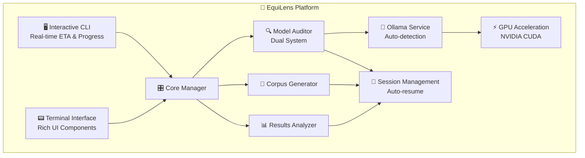
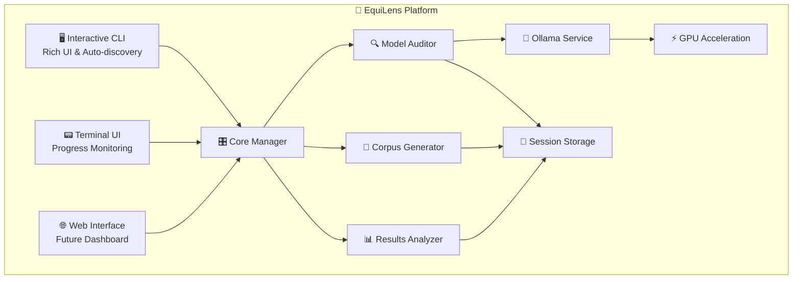

# 🔍 EquiLens - AI Bias Detection Platform

**Professional-grade AI bias detection platform with real-time ETA estimation, GPU acceleration, and comprehensive auditing capabilities**

| License | Python | Docker | Platform |
|---------|--------|--------|----------|
| [](#license) | [](#requirements) | [](#docker-setup) | [](#compatibility) |

## 🌟 Key Features

- 🎯 **Interactive CLI Interface** - Rich terminal UI with guided workflows and smart auto-discovery
- ⏱️ **Real-Time ETA Estimation** - Actual API timing with 1.4x safety buffer for accurate planning
- ⚡ **GPU Acceleration** - NVIDIA CUDA support for 5-10x faster model inference
- 🔄 **Interruption & Resume** - Graceful handling of interruptions with automatic session recovery
- 🎨 **Enhanced Progress Display** - Colorful progress bars with individual test timing metrics
- 📊 **Comprehensive Analytics** - Detailed performance metrics and bias analysis reports
- 🐳 **Docker Integration** - Containerized Ollama with GPU passthrough support
- 🛡️ **Dual Auditor System** - Production-ready auditor with optional beta enhanced features

## 🚀 Quick Start

### ✅ System Check & Setup

```bash
# 🔍 Verify system compatibility and requirements
uv run python verify_setup.py

# 🎮 Check GPU acceleration status
uv run equilens status

# 🚀 Start Ollama services (auto-detects existing containers)
uv run equilens start
```

### 🎯 Interactive Bias Audit (Recommended)

```bash
# 🔍 Launch interactive terminal interface
uv run equilens tui

# ✨ The interactive CLI provides:
# - Auto-discovery of corpus files with ETA estimates
# - Model selection with performance profiling
# - Real-time progress monitoring with colorful displays
# - Automatic session management and resumption
# - Comprehensive completion metrics and analysis
```

### ⚡ Direct Command Usage

```bash
# 📋 List all available models
uv run equilens models list

# 📥 Download a specific model
uv run equilens models pull llama2:latest

# 🔍 Run bias audit with configuration file
uv run equilens audit config.json

# 📊 Generate test corpus
uv run equilens generate corpus_config.json

# 📈 Analyze existing results
uv run equilens analyze results/session_results.csv
```

## 🔧 Installation & Environment

### Using UV (Recommended)
```bash
# 📦 Install dependencies with UV
uv venv
uv pip install -e .

# 🐳 Start Docker services
docker compose up -d

# ✅ Verify installation
uv run equilens --help
```

### Traditional Pip Installation
```bash
# 🐍 Create virtual environment
python -m venv .venv
source .venv/bin/activate  # Windows: .venv\Scripts\activate

# 📦 Install dependencies
pip install -e .

# 🐳 Start services
docker compose up -d
```

## 📋 Command Reference

### Core Commands
| Command  | Description                                     | Example                  |
| -------- | ----------------------------------------------- | ------------------------ |
| `status` | Comprehensive service status with GPU detection | `uv run equilens status` |
| `start`  | Start Ollama services (auto-detection)          | `uv run equilens start`  |
| `stop`   | Stop all services gracefully                    | `uv run equilens stop`   |
| `tui`    | Launch interactive terminal interface           | `uv run equilens tui`    |

### Model Management
| Command                | Description                      | Example                                       |
| ---------------------- | -------------------------------- | --------------------------------------------- |
| `models list`          | List available models with sizes | `uv run equilens models list`                 |
| `models pull <name>`   | Download model with progress     | `uv run equilens models pull phi3:mini`       |
| `models remove <name>` | Remove model from storage        | `uv run equilens models remove llama2:latest` |

### Audit Operations
| Command             | Description                        | Example                                |
| ------------------- | ---------------------------------- | -------------------------------------- |
| `audit <config>`    | Run bias audit with ETA estimation | `uv run equilens audit config.json`    |
| `audit --resume`    | Resume interrupted audit session   | `uv run equilens audit --resume`       |
| `generate <config>` | Generate test corpus               | `uv run equilens generate config.json` |
| `analyze <results>` | Analyze audit results              | `uv run equilens analyze results.csv`  |

## 🎯 Enhanced Features

### ⏱️ **Real-Time ETA Estimation**
- Measures actual API response time for selected model
- Applies 1.4x safety buffer for conservative estimates
- Displays alongside each corpus: `Tests: 6 | ETA: 3m 55s (39.3s/test)`
- Updates estimates based on system performance

### 🔄 **Interruption & Resume Support**
- Automatic progress checkpointing every 10 tests
- Graceful CTRL+C handling with session preservation
- Smart resume detection with `--resume` parameter
- Comprehensive session state recovery

### 🎨 **Enhanced Progress Display**
- Individual test timing with colorful status indicators
- Real-time performance metrics (passed/failed/total)
- Comprehensive completion summary with statistics
- Cross-platform Unicode support with fallback rendering

### 🛡️ **Dual Auditor System**
- **Production Auditor**: Reliable, tested, recommended for production use
- **Enhanced Auditor [BETA](./src/Phase2_ModelAuditor/enhanced_audit_model.py)**: Advanced features with experimental capabilities
- Clear performance metrics comparison and reliability warnings

## 📊 Sample Interactive Workflow

```
🔍 EquiLens - Interactive Bias Audit

Step 1: Model Selection
✓ Found available models:
  1. llama2:latest (3.6GB) - Ready
  2. phi3:mini (2.2GB) - Ready
  3. mistral:7b (4.1GB) - Ready

Step 2: Corpus Selection
✓ Found corpus files:
  1. quick_test_corpus.csv (2.1 KB) | Tests: 6 | ETA: 3m 55s (39.3s/test)
  2. test_corpus.csv (3.8 KB) | Tests: 11 | ETA: 2m 17s (12.5s/test)
  3. audit_corpus_gender_bias.csv (425.2 MB) | Tests: 6,483,456 | ETA: 27230h 30m (45.0s/test)

Step 3: Configuration Review
Model: llama2:latest
Corpus: quick_test_corpus.csv (2.1 KB)
Output Directory: results/llama2_latest_20250809_143022
Silent Mode: Disabled

Test Count: 6
Measured Request Time: 28.1s
Buffered Time per Test: 39.3s (1.4x safety margin)
Estimated Total Time: 3m 55s

Proceed with bias audit? [y/N]: y

Step 4: Executing Bias Audit
Running model evaluation against the test corpus...

Progress: ████████████████████████████████████████ 100% | 6/6 tests | ⏱️ 3m 52s
✓ Test 1: PASSED (32.1s) | ✓ Test 2: PASSED (28.9s) | ✓ Test 3: PASSED (35.2s)
✓ Test 4: PASSED (29.8s) | ✓ Test 5: PASSED (31.4s) | ✓ Test 6: PASSED (30.1s)

🎉 Audit Completed Successfully!

📊 Session Summary:
─────────────────────────────────────────────────────
Tests Completed: 6/6 (100%)
Success Rate: 100.0%
Total Duration: 3m 52s
Average Test Time: 32.3s
Performance Rating: Excellent

Session ID: llama2_latest_20250809_143022
Results: results/llama2_latest_20250809_143022/
```

## 🏗️ Architecture Overview



## 📁 Output Structure

Each audit creates a comprehensive session directory:

```
results/
└── 📁 llama2_latest_20250809_143022/
    ├── 📊 results_llama2_latest_20250809_143022.csv    # Detailed test results
    ├── 📋 progress_20250809_143022.json                # Session progress state
    ├── 📝 summary_20250809_143022.json                 # Performance summary
    ├── 📈 bias_report.png                              # Bias visualization
    └── 📜 session.log                                  # Execution log
```

### 📊 Comprehensive Results Data
- Individual test responses and timing
- Statistical bias analysis and scoring
- Performance metrics and system information
- Visual bias distribution charts
- Detailed recommendations for model improvement

## 🎮 GPU Acceleration

EquiLens automatically detects and utilizes available GPU resources:

```bash
# 🔍 Check comprehensive GPU status
uv run equilens status

# Sample output:
🎮 GPU Support Status
┌────────────────────┬────────┬─────────┐
│ Component          │ Status │ Details │
├────────────────────┼────────┼─────────┤
│ NVIDIA Driver      │ ✅     │ 576.88  │
│ CUDA Runtime       │ ✅     │ 12.9    │
│ Docker GPU Support │ ✅     │ Ready   │
└────────────────────┴────────┴─────────┘

🚀 GPU acceleration is READY!
💡 🎮 GPU acceleration enabled - expect 5-10x faster performance
```

**Performance Benefits:**
- 🚀 **5-10x faster** model inference with GPU acceleration
- ⚡ Automatic detection and configuration
- 🔄 Graceful fallback to CPU-only mode if GPU unavailable
- 📊 Real-time performance monitoring during audits

## 📚 Documentation

Comprehensive documentation available in the `docs/` directory:

- **📖 [CLI_FEATURES.md](docs/CLI_FEATURES.md)** - Complete CLI command reference
- **📖 [INTERRUPTION_RESUMPTION.md](docs/INTERRUPTION_RESUMPTION.md)** - Session management guide
- **📖 [PERFORMANCE_METRICS.md](docs/PERFORMANCE_METRICS.md)** - Metrics and analytics
- **📖 [AUDITOR_COMPARISON.md](docs/AUDITOR_COMPARISON.md)** - Production vs Beta auditor comparison
- **📖 [QUICKSTART.md](docs/QUICKSTART.md)** - Quick setup guide
- **📖 [PIPELINE.md](docs/PIPELINE.md)** - Complete workflow documentation
- **📖 [ARCHITECTURE.md](docs/ARCHITECTURE.md)** - System architecture details
- **📖 [CONFIGURATION_GUIDE.md](docs/CONFIGURATION_GUIDE.md)** - Advanced configuration options

## 🔧 Advanced Configuration

### 📋 Audit Configuration Example

```json
{
  "model": "llama2:latest",
  "corpus_file": "audit_corpus_gender_bias.csv",
  "output_directory": "results",
  "auditor_type": "production",
  "batch_size": 10,
  "timeout": 30,
  "retry_attempts": 3,
  "checkpoint_interval": 10
}
```

### ⚙️ Custom Model Settings

```json
{
  "model_settings": {
    "temperature": 0.7,
    "max_tokens": 150,
    "top_p": 0.9,
    "timeout": 30
  },
  "audit_settings": {
    "enable_timing": true,
    "progress_updates": true,
    "auto_resume": true,
    "detailed_logging": true
  }
}
```

## 🐛 Troubleshooting

### Quick Diagnostics
```bash
# 🔍 Comprehensive system status
uv run equilens status

# 🐳 Docker service status
docker compose ps

# 🤖 Ollama connectivity test
curl http://localhost:11434/api/tags

# 📁 Check session directory permissions
ls -la results/
```

### Common Issues & Solutions

| Issue                      | Symptoms                   | Solution                                          |
| -------------------------- | -------------------------- | ------------------------------------------------- |
| **ETA Timing Fails**       | Fallback estimates used    | Check Ollama service: `uv run equilens start`     |
| **Progress Not Saved**     | Resume doesn't work        | Verify write permissions in `results/` directory  |
| **GPU Not Detected**       | Slow inference performance | Install NVIDIA drivers and Docker GPU support     |
| **Model Download Fails**   | Pull command errors        | Check internet connection and disk space          |
| **Unicode Display Issues** | Broken progress bars       | Use supported terminal (Windows Terminal, iTerm2) |

## 🤝 Contributing

1. 🍴 **Fork** the repository
2. 🌿 **Create** a feature branch: `git checkout -b feature/amazing-feature`
3. 💻 **Develop** your changes with comprehensive testing
4. ✅ **Test** using the interactive CLI: `uv run equilens tui`
5. 📝 **Commit** your changes: `git commit -m 'Add amazing feature'`
6. 🚀 **Push** to branch: `git push origin feature/amazing-feature`
7. 🔄 **Open** a Pull Request with detailed description

### Development Guidelines
- Follow Python 3.13+ best practices
- Maintain comprehensive error handling
- Test across different operating systems
- Update documentation for new features
- Preserve backward compatibility

## ⚙️ System Requirements

**Minimum Requirements:**
- **Python 3.13+** for latest language features and performance
- **Docker Desktop** with Compose V2 support
- **4GB RAM** for basic model processing
- **10GB disk space** for models and results

**Recommended Configuration:**
- **NVIDIA GPU** with CUDA support for acceleration
- **16GB+ RAM** for large corpus processing
- **50GB+ SSD storage** for model caching
- **Modern terminal** with Unicode support (Windows Terminal, iTerm2)

## 🌍 Platform Compatibility

- ✅ **Windows 10/11** (WSL2 recommended for optimal Docker performance)
- ✅ **macOS** (Intel and Apple Silicon with Docker Desktop)
- ✅ **Linux** (Ubuntu 20.04+, Fedora, Arch, RHEL)
- ✅ **Docker Desktop** or **Docker Engine** with Compose V2
- ✅ **VS Code** with Dev Containers extension for development

## 📄 License

This project is licensed under the **Apache License 2.0** - see the [LICENSE.md](LICENSE.md) file for details.

### Quick License Summary
- ✅ **Commercial use** permitted
- ✅ **Modification and distribution** allowed
- ✅ **Patent protection** included
- 📋 **Attribution** required
- 🛡️ **No warranty** provided

## 🎉 What's New in Latest Version

### 🚀 **Major Enhancements**
- **Real-Time ETA Estimation**: Actual API timing with 1.4x safety buffer
- **Interruption & Resume**: Graceful session management with auto-recovery
- **Enhanced Progress Display**: Colorful progress bars with individual test metrics
- **Dual Auditor System**: Production-ready and beta experimental auditors
- **Comprehensive Analytics**: Detailed performance metrics and completion summaries

### 🎯 **User Experience Improvements**
- Smart auto-discovery of corpus files and models
- Interactive CLI with Rich terminal UI components
- Cross-platform Unicode support with automatic fallbacks
- Organized session-based output with comprehensive metadata
- Professional-grade error handling and user feedback

### ⚡ **Performance Optimizations**
- GPU acceleration with automatic detection and fallback
- Efficient Docker container management with auto-detection
- Optimized model caching and persistent storage
- Real-time performance monitoring and metrics collection

---

## 🚀 Getting Started Today

**Ready to detect AI bias with professional-grade tooling?**

```bash
# 🔍 Start with system verification
uv run python verify_setup.py

# 🎯 Launch interactive interface
uv run equilens tui

# 📊 Check system status anytime
uv run equilens status
```

**Experience the difference with EquiLens - where AI bias detection meets professional software development practices!** 🎯

---

> **💡 Pro Tip**: Start with `uv run equilens status` to verify your setup, then `uv run equilens tui` for the full interactive experience!


### 🔧 Manual Setup

```bash
# 1. 📦 Environment Setup
uv venv
uv pip install -r pyproject.toml

# 2. 🐳 Start Services (Docker)
docker compose up -d

# 3. 🔍 Run Bias Audit
uv run python src/Phase2_ModelAuditor/audit_model.py \
  --model phi3:mini \
  --corpus src/Phase1_CorpusGenerator/corpus/audit_corpus_gender_bias.csv

# 4. 📊 Analyze Results
uv run python src/Phase3_Analysis/analyze_results.py \
  --results_file results/results_phi3_mini_*.csv
```

### 4. Platform Launchers (Auto-activates venv)
```bash
# Windows (double-click or command line)
equilens.bat gpu-check
equilens.bat start

# Linux/macOS
chmod +x equilens.sh
./equilens.sh gpu-check
./equilens.sh start
```

## 🎮 GPU Acceleration

EquiLens automatically detects and uses GPU acceleration when available:

- **🔍 Check GPU Status**: `python equilens.py gpu-check`
- **🎯 Auto-Detection**: GPU automatically used if CUDA + Docker GPU support available
- **⚡ CPU Fallback**: Seamless fallback to CPU-only mode
- **📋 Setup Guidance**: Direct links to NVIDIA CUDA downloads

**Performance Impact**: 5-10x faster model inference with GPU acceleration

```
./equilens.sh start
```

## 🏗️ Architecture

```
┌─────────────────┐    ┌──────────────────┐    ┌─────────────────┐
│   Host Machine  │───▶│   Docker Engine  │───▶│   Containers    │
│                 │    │                  │    │                 │
│ equilens.py     │    │ docker-compose   │    │ • Ollama        │
│ equilens.bat    │    │                  │    │ • EquiLens App  │
│ equilens.sh     │    │                  │    │                 │
└─────────────────┘    └──────────────────┘    └─────────────────┘
```

## 📋 Available Commands

| Command              | Description           | Example                                   |
| -------------------- | --------------------- | ----------------------------------------- |
| `start`              | Start all services    | `python equilens.py start`                |
| `stop`               | Stop all services     | `python equilens.py stop`                 |
| `status`             | Show service status   | `python equilens.py status`               |
| `models list`        | List available models | `python equilens.py models list`          |
| `models pull <name>` | Download model        | `python equilens.py models pull llama3.2` |
| `audit <config>`     | Run bias audit        | `python equilens.py audit config.json`    |
| `generate <config>`  | Generate test corpus  | `python equilens.py generate config.json` |
| `analyze <results>`  | Analyze results       | `python equilens.py analyze results.csv`  |

## 🎯 Key Features

### ✅ **Smart Ollama Detection**
- Automatically detects existing Ollama containers
- Uses external Ollama if available and accessible
- Creates new Ollama container only if needed
- Preserves model downloads across restarts

### ✅ **Platform Independence**
- Single Python CLI works on Windows, Linux, macOS
- Optional platform launchers for convenience
- No platform-specific dependencies
- Consistent experience across environments

### ✅ **Persistent Model Storage**
- Models stored in Docker volumes
- Survive container restarts
- No re-downloading after `docker compose down`
- Efficient model sharing between runs

### ✅ **GPU Acceleration**
- Automatic NVIDIA GPU detection and utilization
- Fallback to CPU if GPU unavailable
- Optimized for Windows 11 + RTX GPUs

### ✅ **Fast Dependency Management**
- Uses `uv` for lightning-fast package installation
- Virtual environment isolation
- Automatic dependency resolution
- No conflicts with system Python

## 🛠️ Development Tools

```bash
# Create new bias configuration
python tools/quick_setup.py

# Validate configuration
python tools/validate_config.py config.json

# Run mock Ollama for testing
python tools/mock_ollama.py
```

## 📁 Project Structure

```
EquiLens/
├── equilens.py              # 🎯 Main unified CLI
├── equilens.bat             # 🪟 Windows launcher
├── equilens.sh              # 🐧 Unix/Linux launcher
├── docker-compose.yml       # 🐳 Container orchestration
├── Dockerfile               # 📦 App container definition
├── requirements.txt         # 📋 Python dependencies
├── Phase1_CorpusGenerator/  # 📝 Corpus generation
├── Phase2_ModelAuditor/     # 🔍 Bias auditing
├── Phase3_Analysis/         # 📊 Result analysis
├── results/                 # 📈 Audit outputs
├── docs/                    # 📚 Documentation
└── tools/                   # 🛠️ Development utilities
```

## 🔧 Configuration

### Example Bias Configuration
```json
{
  "bias_type": "gender",
  "target_words": ["doctor", "nurse", "engineer"],
  "bias_words": {
    "male": ["he", "him", "man"],
    "female": ["she", "her", "woman"]
  },
  "templates": [
    "The {target} said {pronoun} would help.",
    "{pronoun} is a skilled {target}."
  ]
}
```

## 📊 Example Workflow

```bash
# 1. Start services
python equilens.py start

# 2. Download a model
python equilens.py models pull phi3:mini

# 3. Generate test corpus
python equilens.py generate bias_config.json

# 4. Run bias audit
python equilens.py audit bias_config.json
```

---

## 🏗️ System Architecture



## 📊 Results & Output

After running EquiLens, your results are organized in session directories:

```
results/
└── 📁 phi3_mini_20250808_123456/
    ├── 📊 results_phi3_mini_20250808_123456.csv   # Detailed audit data
    ├── 📋 progress_20250808_123456.json           # Session progress
    ├── 📝 summary_20250808_123456.json            # Session summary
    ├── 📈 bias_report.png                         # Bias visualization
    ├── 📋 session_metadata.json                   # Configuration
    └── 📜 session.log                             # Execution log
```

### 📈 Sample Bias Report

The bias analysis includes:
- Statistical significance testing
- Bias score calculations
- Visual bias distribution charts
- Detailed recommendations for model improvement

## 🔧 Advanced Configuration

### 📋 Custom Corpus Generation

```json
{
  "bias_categories": {
    "gender": {
      "male_words": ["he", "him", "his", "man", "boy"],
      "female_words": ["she", "her", "hers", "woman", "girl"],
      "neutral_words": ["person", "individual", "someone"]
    }
  },
  "prompt_templates": [
    "The {category} is good at {skill}",
    "{category} people are known for {trait}"
  ]
}
```

### ⚙️ Model Configuration

```json
{
  "model_settings": {
    "temperature": 0.7,
    "max_tokens": 100,
    "timeout": 30
  },
  "audit_settings": {
    "batch_size": 10,
    "retry_attempts": 3,
    "progress_checkpoint": 10
  }
}
```

## 🎮 GPU Acceleration

EquiLens automatically detects and utilizes GPU acceleration:

```bash
# Check GPU availability
nvidia-smi

# Verify GPU usage in EquiLens
uv run equilens status
# The CLI will show GPU status during model detection
```

**Performance Benefits:**
- 🚀 **5-10x faster** model inference with GPU
- ⚡ Automatic GPU detection and configuration
- 🔄 Graceful fallback to CPU-only mode
- 📊 Real-time performance monitoring

## 📚 Documentation

- **📖 [QUICKSTART.md](docs/QUICKSTART.md)** - Quick setup guide
- **📖 [PIPELINE.md](docs/PIPELINE.md)** - Complete workflow guide
- **📖 [ARCHITECTURE.md](docs/ARCHITECTURE.md)** - System architecture details
- **📖 [CONFIGURATION_GUIDE.md](docs/CONFIGURATION_GUIDE.md)** - Advanced configuration
- **📖 [EXECUTION_GUIDE.md](docs/EXECUTION_GUIDE.md)** - Detailed execution instructions
- **📖 [OLLAMA_SETUP.md](docs/OLLAMA_SETUP.md)** - Ollama configuration guide

## 🐛 Troubleshooting

### Quick Diagnostics
```bash
# 🔍 Comprehensive system check
uv run equilens --help

# 🐳 Docker status
docker compose ps

# 🤖 Ollama connectivity
curl http://localhost:11434/api/tags
```

### Common Solutions
| Issue                | Symptoms               | Solution                            |
| -------------------- | ---------------------- | ----------------------------------- |
| **Unicode Errors**   | Emoji display issues   | Handled automatically by CLI        |
| **Model Not Found**  | Auto-discovery fails   | Check Ollama service status         |
| **GPU Not Detected** | Slow inference         | Verify NVIDIA drivers & Docker GPU  |
| **File Permissions** | Session creation fails | Check write permissions in results/ |

## 🤝 Contributing

1. 🍴 Fork the repository
2. 🌿 Create a feature branch (`git checkout -b feature/amazing-feature`)
3. 💻 Make your changes
4. ✅ Test with the interactive CLI
5. 📝 Commit your changes (`git commit -m 'Add amazing feature'`)
6. 🚀 Push to the branch (`git push origin feature/amazing-feature`)
7. 🔄 Open a Pull Request

## Requirements

- **Python 3.13+** for latest features and performance
- **Docker Desktop** with Compose V2 support
- **uv** package manager (recommended over pip)
- **NVIDIA GPU** (optional, for acceleration)
- **4GB+ RAM** recommended for model processing

## Compatibility

- ✅ **Windows 10/11** (WSL2 recommended for Docker)
- ✅ **macOS** (Intel and Apple Silicon)
- ✅ **Linux** (Ubuntu 20.04+, Fedora, Arch)
- ✅ **Docker Desktop** or **Docker Engine**
- ✅ **VS Code** with Dev Containers extension

## Docker Setup

### Quick Start
```bash
# 🚀 One-command setup
docker compose up -d

# 🔍 Verify services
docker compose ps
```

### GPU Configuration
```bash
# 🎮 GPU-enabled setup
docker compose -f docker-compose.gpu.yml up -d

# ✅ Test GPU access
docker exec -it equilens-ollama-1 nvidia-smi
```

## License

This project is licensed under the **Apache License 2.0** - see the [LICENSE.md](LICENSE.md) file for details.

### 🎯 Quick License Summary
- ✅ **Commercial use allowed**
- ✅ **Modification and distribution permitted**
- ✅ **Patent protection included**
- 📋 **Attribution required**
- 🛡️ **No warranty provided**

## 🎉 Success Story

EquiLens has evolved from a complex multi-script system to a streamlined, production-ready platform:

- 🎨 **Enhanced User Experience**: Interactive CLI with Rich UI
- 🔧 **Simplified Workflow**: Auto-discovery and guided setup
- ⚡ **Performance Optimized**: GPU acceleration and efficient processing
- 📁 **Organized Output**: Session-based file management
- 🐳 **Container Ready**: Docker integration with GPU support
- 📊 **Professional Results**: Comprehensive bias analysis and reporting

**Ready to detect AI bias?** Start with `uv run equilens --help` and experience the difference! 🚀

---

>**💡 Pro Tip**: Start with `uv run equilens status` to check your system, then `uv run equilens start` to begin!
