# 🔍 EquiLens - AI Bias Detection Platform

**A comprehensive platform for detecting and analyzing bias in AI language models**

[](https://opensource.org/licenses/Apache-2.0)
[](https://python.org)
[](https://docker.com)
[](https://github.com/astral-sh/uv)
[](https://doi.org/10.5281/zenodo.17014103)

---

**EquiLens** is a state-of-the-art bias detection framework designed for **Small Language Models (SLMs)** and **Large Language Models (LLMs)**. Built as part of a final-year research project at **Amrita Vishwa Vidyapeetham**, EquiLens provides researchers, developers, and organizations with powerful tools to identify, measure, and analyze bias in AI systems.

## 🌟 Key Features

### 🎯 **Interactive CLI Interface**
- Rich terminal UI with guided workflows and smart auto-discovery
- Modern Typer-based CLI with comprehensive help system
- Cross-platform launchers (Windows `.bat`, Unix `.sh`)

### ⏱️ **Real-Time ETA Estimation**
- Actual API timing with 1.4x safety buffer for accurate planning
- Multi-prompt averaging for reliable time estimates
- Dynamic ETA updates during execution

### ⚡ **GPU Acceleration**
- NVIDIA CUDA support for 5-10x faster model inference
- Automatic GPU detection and configuration
- Graceful fallback to CPU-only mode

### 🔄 **Interruption & Resume Support**
- Graceful handling of interruptions with automatic session recovery
- Persistent session state across restarts
- Resume from exact point of interruption

### 🎨 **Enhanced Progress Display**
- Rich progress bars with individual test timing metrics
- Real-time performance monitoring
- Colorful, informative status indicators

### 📊 **Comprehensive Analytics**
- Detailed performance metrics and bias analysis reports
- Statistical analysis with visualization
- Export capabilities for further research

### 🐳 **Docker Integration**
- Containerized Ollama with GPU passthrough support
- Automatic service detection and management
- Persistent model storage

### 🛡️ **Dual Auditor System**
- Production-ready auditor for reliable results
- Enhanced auditor with experimental features
- Clear performance metrics comparison

## 🚀 Quick Start

### Prerequisites
- **Python 3.11+** (3.13 recommended)
- **Docker Desktop** or **Docker Engine**
- **4GB+ RAM** (8GB+ recommended)
- **2GB+ free disk space**

### Installation

```bash
# Clone the repository
git clone https://github.com/Life-Experimentalists/EquiLens.git
cd EquiLens

# Install UV (fast Python package manager)
pip install uv

# Install dependencies
uv sync

# Verify installation
python verify_setup.py
```

**Sample verification output:**
```
🔍 EquiLens System Verification

✓ Python 3.13.x detected
✓ Required packages installed
✓ Directory structure validated
✓ Docker available
✓ System resources sufficient (8GB RAM, 15GB disk)
✓ UV package manager ready
✓ Virtual environment configured

🎉 EquiLens is ready for use!

💡 Next steps:
   1. uv run equilens status    # Check system status
   2. uv run equilens start     # Start Ollama services
   3. uv run equilens tui       # Launch interactive interface
```

### Basic Usage

```bash
# 1. Check system status and GPU availability
uv run equilens status

# 2. Start Ollama services (auto-detects existing containers)
uv run equilens start

# 3. Download a model for testing
uv run equilens models pull phi3:mini

# 4. Generate test corpus
uv run equilens generate

# 5. Run bias audit
uv run equilens audit

# 6. Analyze results
uv run equilens analyze results/latest_session.csv
```

### Interactive Mode

```bash
# Launch interactive terminal interface
uv run equilens tui
```

## 🖥️ Terminal User Interface (TUI)

EquiLens features a modern, interactive Terminal UI built with Textual for an enhanced user experience:

### 🎨 TUI Features
- **📊 Real-time Progress Monitoring** - Live progress bars with ETA estimates
- **🎛️ Interactive Controls** - Pause, resume, and stop operations
- **📈 Performance Metrics** - Live system resource monitoring
- **📋 Session Management** - View and manage active/past sessions
- **🔍 Log Viewer** - Real-time log streaming with filtering
- **⚙️ Settings Panel** - Adjust preferences without config files

### 🚀 TUI Navigation
```
┌─────────────────────────────────────────────────────────────┐
│                    🔍 EquiLens TUI v1.0                     │
├─────────────────────────────────────────────────────────────┤
│  📊 Dashboard    🔍 Audit    📝 Generate    📈 Analyze      │
├─────────────────────────────────────────────────────────────┤
│                                                             │
│  🎯 Current Session: llama2_latest_20250813_143022          │
│  📊 Progress: ████████████████████ 100% | 6/6 tests        │
│  ⏱️ Runtime: 3m 52s | 📈 Avg: 32.3s/test                   │
│                                                             │
│  🎮 GPU: RTX 4090 (Ready) | 💾 RAM: 8.2GB/16GB             │
│  🐳 Docker: 3 containers running | 🤖 Ollama: Healthy      │
│                                                             │
├─────────────────────────────────────────────────────────────┤
│  [F1] Help | [F2] Settings | [ESC] Exit | [TAB] Navigate   │
└─────────────────────────────────────────────────────────────┘
```

### 📱 TUI Quick Actions
- **Ctrl+C** - Graceful interrupt with session save
- **F1** - Context-sensitive help
- **F2** - Settings and configuration
- **Tab/Shift+Tab** - Navigate between panels
- **Enter** - Activate selected item
- **Space** - Toggle pause/resume
- **ESC** - Return to previous screen or exit

## ⚙️ System Requirements

### Minimum Requirements
- **Operating System**: Windows 10+, macOS 10.15+, Ubuntu 18.04+
- **Python**: 3.11 or newer (3.13 recommended)
- **RAM**: 4GB (8GB+ recommended for better performance)
- **Disk Space**: 2GB free space (additional space for models)
- **Docker**: Latest version with compose support

### Recommended for Optimal Performance
- **RAM**: 16GB+ for large model processing
- **GPU**: NVIDIA GPU with 4GB+ VRAM for acceleration
- **CUDA**: Latest CUDA drivers for GPU support
- **SSD**: For faster model loading and data processing

### Platform Compatibility
- ✅ **Windows 10/11** (WSL2 recommended for Docker)
- ✅ **macOS** (Intel and Apple Silicon supported)
- ✅ **Linux** (Ubuntu 20.04+, Fedora, Arch, CentOS)
- ✅ **Docker Desktop** or **Docker Engine**
- Automatic session management and resumption
- Comprehensive completion metrics and analysis

```bash
# 🔍 Launch interactive terminal interface
uv run equilens tui
```


### ⚡ Direct Command Usage

```bash
# 📋 List all available models
uv run equilens models list
```

```bash
# 📥 Download a specific model
uv run equilens models pull llama2:latest
```

```bash
# 🔍 Run bias audit
uv run equilens audit
```

```bash
# 📊 Generate test corpus using custom config files
uv run equilens generate --config corpus_config.json
```

```bash
# 📈 Analyze existing results
uv run equilens analyze results/session_results.csv
```

## 🔧 Installation & Environment

### Using UV (Recommended)
```bash
# 📦 Install dependencies with UV
uv venv
uv pip install -e .
```

```bash
# 🐳 Start Docker services
docker compose up -d
```

```bash
# ✅ Verify installation
uv run equilens --help
```

### Traditional Pip Installation
```bash
# 🐍 Create virtual environment
python -m venv .venv
source .venv/bin/activate  # Windows: .venv\Scripts\activate
```

```bash
# 📦 Install dependencies
pip install -e .
```

```bash
# 🐳 Start services
docker compose up -d
```

## 📋 Command Reference

### Core Commands
| Command  | Description                                     | Example                  |
| -------- | ----------------------------------------------- | ------------------------ |
| `status` | Comprehensive service status with GPU detection | `uv run equilens status` |
| `start`  | Start Ollama services (auto-detection)          | `uv run equilens start`  |
| `stop`   | Stop all services gracefully                    | `uv run equilens stop`   |
| `tui`    | Launch interactive terminal interface           | `uv run equilens tui`    |

### Model Management
| Command                | Description                      | Example                                       |
| ---------------------- | -------------------------------- | --------------------------------------------- |
| `models list`          | List available models with sizes | `uv run equilens models list`                 |
| `models pull <name>`   | Download model with progress     | `uv run equilens models pull phi3:mini`       |
| `models remove <name>` | Remove model from storage        | `uv run equilens models remove llama2:latest` |

### Audit Operations
| Command             | Description                        | Example                                |
| ------------------- | ---------------------------------- | -------------------------------------- |
| `audit`    | Resume interrupted audit session   | `uv run equilens audit`       |
| `generate --config` | Generate test corpus using custom config | `uv run equilens generate |
| `analyze <results>` | Analyze audit results              | `uv run equilens analyze results.csv`  |

## 🎯 Enhanced Features

### ⏱️ **Real-Time ETA Estimation**
- Measures actual API response time for selected model
- Applies 1.4x safety buffer for conservative estimates
- Displays alongside each corpus: `Tests: 6 | ETA: 3m 55s (39.3s/test)`
- Updates estimates based on system performance

### 🔄 **Interruption & Resume Support**
- Automatic progress checkpointing every 10 tests
- Graceful CTRL+C handling with session preservation
- Smart resume detection with `--resume` parameter
- Comprehensive session state recovery

### 🎨 **Enhanced Progress Display**
- Individual test timing with colorful status indicators
- Real-time performance metrics (passed/failed/total)
- Comprehensive completion summary with statistics
- Cross-platform Unicode support with fallback rendering

### 🛡️ **Dual Auditor System**
- **Production Auditor**: Reliable, tested, recommended for production use
- **Enhanced Auditor [BETA](./src/Phase2_ModelAuditor/enhanced_audit_model.py)**: Advanced features with experimental capabilities
- Clear performance metrics comparison and reliability warnings

## 📊 Sample Interactive Workflow

```
🔍 EquiLens - Interactive Bias Audit

Step 1: Model Selection
✓ Found available models:
  1. llama2:latest (3.6GB) - Ready
  2. phi3:mini (2.2GB) - Ready
  3. mistral:7b (4.1GB) - Ready

Step 2: Corpus Selection
✓ Found corpus files:
  1. quick_test_corpus.csv (2.1 KB) | Tests: 6 | ETA: 3m 55s (39.3s/test)
  2. test_corpus.csv (3.8 KB) | Tests: 11 | ETA: 2m 17s (12.5s/test)
  3. audit_corpus_gender_bias.csv (425.2 MB) | Tests: 6,483,456 | ETA: 27230h 30m (45.0s/test)

Step 3: Configuration Review
Model: llama2:latest
Corpus: quick_test_corpus.csv (2.1 KB)
Output Directory: results/llama2_latest_20250809_143022
Silent Mode: Disabled

Test Count: 6
Measured Request Time: 28.1s
Buffered Time per Test: 39.3s (1.4x safety margin)
Estimated Total Time: 3m 55s

Proceed with bias audit? [y/N]: y

Step 4: Executing Bias Audit
Running model evaluation against the test corpus...

Progress: ████████████████████████████████████████ 100% | 6/6 tests | ⏱️ 3m 52s
✓ Test 1: PASSED (32.1s) | ✓ Test 2: PASSED (28.9s) | ✓ Test 3: PASSED (35.2s)
✓ Test 4: PASSED (29.8s) | ✓ Test 5: PASSED (31.4s) | ✓ Test 6: PASSED (30.1s)

🎉 Audit Completed Successfully!

📊 Session Summary:
─────────────────────────────────────────────────────
Tests Completed: 6/6 (100%)
Success Rate: 100.0%
Total Duration: 3m 52s
Average Test Time: 32.3s
Performance Rating: Excellent

Session ID: llama2_latest_20250809_143022
Results: results/llama2_latest_20250809_143022/
```

## 🏗️ Platform Architecture

EquiLens follows a modular, three-phase architecture designed for scalability and maintainability:

```
┌─────────────────────────────────────────────────────────────────┐
│                     🎯 EquiLens Platform                        │
├─────────────────────────────────────────────────────────────────┤
│  🖥️ Interactive CLI          📟 Terminal UI        🌐 Web UI   │
│     (Typer + Rich)            (Textual)            (FastAPI)    │
└─────────────────┬───────────────────────┬───────────────────────┘
                  │                       │
                  ▼                       ▼
         ┌─────────────────────┐ ┌─────────────────────┐
         │   🎛️ Core Manager   │ │   🔍 GPU Manager    │
         │  (Orchestration)    │ │  (CUDA Detection)   │
         └─────────┬───────────┘ └─────────────────────┘
                   │
                   ▼
    ┌──────────────────────────────────────────────────┐
    │              🐳 Docker Manager                   │
    │        (Container Orchestration)                 │
    └─────────┬──────────────────────────┬─────────────┘
              │                          │
              ▼                          ▼
    ┌──────────────────┐        ┌─────────────────┐
    │  📝 Phase 1      │        │  🔍 Phase 2     │
    │ Corpus Generator │        │ Model Auditor   │
    │                  │        │                 │
    │ • Interactive    │        │ • Dual System   │
    │ • Validation     │        │ • GPU Accel     │
    │ • Cross-platform │        │ • Resume Logic  │
    └──────────────────┘        └─────────────────┘
              │                          │
              ▼                          ▼
    ┌─────────────────┐        ┌─────────────────┐
    │  📊 Phase 3     │        │  🤖 Ollama      │
    │ Result Analysis │        │   Service       │
    │                 │        │                 │
    │ • Visualization │        │ • Auto-detect   │
    │ • Statistics    │        │ • Model Storage │
    │ • Export        │        │ • API Gateway   │
    └─────────────────┘        └─────────────────┘
```

### Core Components

#### 🎛️ **Core Manager** (`src/equilens/core/manager.py`)
Central orchestrator that coordinates all platform operations, service management, and workflow execution.

#### 🔍 **GPU Manager** (`src/equilens/core/gpu.py`)
Handles NVIDIA GPU detection, CUDA availability checking, and performance optimization recommendations.

#### � **Docker Manager** (`src/equilens/core/docker.py`)
Manages container lifecycle, service discovery, and automated Ollama deployment with GPU passthrough.

#### 📝 **Phase 1: Corpus Generator** (`src/Phase1_CorpusGenerator/`)
Interactive corpus generation with strict validation, cross-platform compatibility, and configurable bias comparisons.

#### 🔍 **Phase 2: Model Auditor** (`src/Phase2_ModelAuditor/`)
Dual auditor system (Production + Enhanced) with real-time ETA, interruption handling, and comprehensive error recovery.

#### 📊 **Phase 3: Result Analysis** (`src/Phase3_Analysis/`)
Statistical analysis engine with visualization capabilities and export functionality for research papers.

## 📁 Project Structure

```
EquiLens/
├── 📁 src/
│   ├── 📁 equilens/                 # Core platform package
│   │   ├── 📄 cli.py               # Modern CLI interface (Typer + Rich)
│   │   ├── 📄 tui.py               # Terminal UI (Textual)
│   │   ├── 📄 web.py               # Web interface (FastAPI)
│   │   └── � core/                # Core management modules
│   │       ├── 📄 manager.py       # Central orchestrator
│   │       ├── 📄 gpu.py           # GPU detection & management
│   │       └── 📄 docker.py        # Container orchestration
│   │
│   ├── 📁 Phase1_CorpusGenerator/  # Bias corpus generation
│   │   ├── 📄 generate_corpus.py   # Interactive corpus generator
│   │   ├── 📄 test_config.py       # Strict validation system
│   │   ├── 📄 word_lists.json      # Bias comparison configurations
│   │   └── 📄 package_for_zenodo.ps1 # Research packaging script
│   │
│   ├── 📁 Phase2_ModelAuditor/     # Model bias auditing
│   │   ├── � audit_model.py       # Production auditor (stable)
│   │   └── 📄 enhanced_audit_model.py # Enhanced auditor (beta)
│   │
│   ├── 📁 Phase3_Analysis/         # Results analysis
│   │   └── 📄 analyze_results.py   # Statistical analysis & visualization
│   │
│   └── 📁 tools/                   # Development utilities
│       ├── 📄 quick_setup.py       # Interactive configuration creator
│       ├── 📄 validate_config.py   # Configuration validator
│       └── 📄 mock_ollama.py       # Testing mock server
│
├── 📁 docs/                        # Comprehensive documentation
│   ├── 📄 QUICKSTART.md           # 5-minute setup guide
│   ├── 📄 ARCHITECTURE.md         # System design details
│   ├── 📄 CLI_FEATURES.md         # Interactive CLI guide
│   └── 📄 EXECUTION_GUIDE.md      # Advanced execution patterns
│
├── 📁 results/                     # Audit session outputs
├── 📄 docker-compose.yml          # Container orchestration
├── 📄 Dockerfile                  # Application container
├── 📄 pyproject.toml              # Modern Python packaging
├── 📄 verify_setup.py             # System verification script
├── 📄 equilens.bat                # Windows launcher
├── 📄 equilens.sh                 # Unix/Linux launcher
└── 📄 README.md                   # This comprehensive guide
```

## � Complete Command Reference

### Core Commands

| Command  | Description                                    | Example                  |
| -------- | ---------------------------------------------- | ------------------------ |
| `status` | Comprehensive system status with GPU detection | `uv run equilens status` |
| `start`  | Start Ollama services with auto-detection      | `uv run equilens start`  |
| `stop`   | Stop all services gracefully                   | `uv run equilens stop`   |
| `tui`    | Launch interactive terminal interface          | `uv run equilens tui`    |

### Model Management

| Command                | Description                           | Example                                       |
| ---------------------- | ------------------------------------- | --------------------------------------------- |
| `models list`          | List available models with sizes      | `uv run equilens models list`                 |
| `models pull <name>`   | Download model with progress tracking | `uv run equilens models pull phi3:mini`       |
| `models remove <name>` | Remove model from storage             | `uv run equilens models remove llama2:latest` |

### Audit Operations

| Command            | Description                                | Example                                  |
| ------------------ | ------------------------------------------ | ---------------------------------------- |
| `audit`            | Interactive bias audit with auto-discovery | `uv run equilens audit`                  |
| `resume`           | Resume interrupted audit session           | `uv run equilens resume`                 |
| `resume <session>` | Resume specific session                    | `uv run equilens resume llama2_20250809` |

### Corpus Generation

| Command             | Description                        | Example                                                |
| ------------------- | ---------------------------------- | ------------------------------------------------------ |
| `generate`          | Interactive corpus generation      | `uv run equilens generate`                             |
| `generate --config` | Generate with custom configuration | `uv run equilens generate --config corpus_config.json` |

### Analysis & Results

| Command          | Description                   | Example                                       |
| ---------------- | ----------------------------- | --------------------------------------------- |
| `analyze`        | Interactive result analysis   | `uv run equilens analyze`                     |
| `analyze <file>` | Analyze specific results file | `uv run equilens analyze results/session.csv` |

### System & Diagnostics

| Command     | Description                      | Example                     |
| ----------- | -------------------------------- | --------------------------- |
| `gpu-check` | Detailed GPU acceleration status | `uv run equilens gpu-check` |
| `--version` | Show platform version            | `uv run equilens --version` |
| `--help`    | Show comprehensive help          | `uv run equilens --help`    |

## 📁 Output Structure & Results

Each audit creates a comprehensive session directory:

```
results/
└── 📁 llama2_latest_20250809_143022/
    ├── 📊 results_llama2_latest_20250809_143022.csv    # Detailed test results
    ├── 📋 progress_20250809_143022.json                # Session progress state
    ├── 📝 summary_20250809_143022.json                 # Performance summary
    ├── 📈 bias_report.png                              # Bias visualization
    └── 📜 session.log                                  # Execution log
```

### 📊 Comprehensive Results Data
- **Individual test responses and timing** - Complete audit trail with timestamps
- **Statistical bias analysis and scoring** - Quantitative bias measurements
- **Performance metrics and system information** - Hardware utilization and efficiency
- **Visual bias distribution charts** - Easy-to-understand bias pattern visualization
- **Detailed recommendations** - Actionable insights for model improvement

## 📋 Sample Interactive Workflow

```
🔍 EquiLens - Interactive Bias Audit

Step 1: Model Selection
✓ Found available models:
  1. llama2:latest (3.6GB) - Ready
  2. phi3:mini (2.1GB) - Ready
  3. gemma2:2b (1.8GB) - Ready

Select model [1-3]: 1

Step 2: Corpus Discovery & ETA Estimation
✓ Found corpus files with ETA estimates:
  1. gender_bias_professional (6 tests) - ETA: 3m 55s (39.3s/test)
  2. gender_bias_academic (12 tests) - ETA: 7m 48s (39.0s/test)
  3. custom_bias_test (4 tests) - ETA: 2m 36s (39.0s/test)

Select corpus [1-3]: 1

Step 3: Final Confirmation
Model: llama2:latest
Corpus: gender_bias_professional (6 tests)
Estimated Duration: 3m 55s
Output Directory: results/llama2_latest_20250809_143022/

Proceed with bias audit? [y/N]: y

Step 4: Executing Bias Audit
Running model evaluation against the test corpus...

Progress: ████████████████████████████████████████ 100% | 6/6 tests | ⏱️ 3m 52s
✓ Test 1: PASSED (32.1s) | ✓ Test 2: PASSED (28.9s) | ✓ Test 3: PASSED (35.2s)
✓ Test 4: PASSED (29.8s) | ✓ Test 5: PASSED (31.4s) | ✓ Test 6: PASSED (30.1s)

🎉 Audit Completed Successfully!

📊 Session Summary:
─────────────────────────────────────────────────────
Tests Completed: 6/6 (100%)
Success Rate: 100.0%
Total Duration: 3m 52s
Average Test Time: 32.3s
Performance Rating: Excellent

Session ID: llama2_latest_20250809_143022
Results: results/llama2_latest_20250809_143022/
```
- Statistical bias analysis and scoring
- Performance metrics and system information
- Visual bias distribution charts
- Detailed recommendations for model improvement

## 🎮 GPU Acceleration

EquiLens automatically detects and utilizes available GPU resources:

```bash
# 🔍 Check comprehensive GPU status
uv run equilens status

# Sample output:
🎮 GPU Support Status
┌────────────────────┬────────┬─────────┐
│ Component          │ Status │ Details │
├────────────────────┼────────┼─────────┤
│ NVIDIA Driver      │ ✅     │ 576.88  │
│ CUDA Runtime       │ ✅     │ 12.9    │
│ Docker GPU Support │ ✅     │ Ready   │
└────────────────────┴────────┴─────────┘

🚀 GPU acceleration is READY!
💡 🎮 GPU acceleration enabled - expect 5-10x faster performance
```

**Performance Benefits:**
- 🚀 **5-10x faster** model inference with GPU acceleration
- ⚡ Automatic detection and configuration
- 🔄 Graceful fallback to CPU-only mode if GPU unavailable
- 📊 Real-time performance monitoring during audits

## 📚 Documentation

Comprehensive documentation available in the `docs/` directory:


## 🔧 Advanced Configuration

### 📋 Audit Configuration Example

```json
{
  "model": "llama2:latest",
  "corpus_file": "audit_corpus_gender_bias.csv",
  "output_directory": "results",
  "auditor_type": "production",
  "batch_size": 10,
  "timeout": 30,
  "retry_attempts": 3,
  "checkpoint_interval": 10
}
```

### ⚙️ Custom Model Settings

```json
{
  "model_settings": {
    "temperature": 0.7,
    "max_tokens": 150,
    "top_p": 0.9,
    "timeout": 30
  },
  "audit_settings": {
    "enable_timing": true,
    "progress_updates": true,
    "auto_resume": true,
    "detailed_logging": true
  }
}
```

## 🐛 Troubleshooting

### Quick Diagnostics
```bash
# 🔍 Comprehensive system status
uv run equilens status
```

```bash
# 🐳 Docker service status
docker compose ps
```

```bash
# 🤖 Ollama connectivity test
curl http://localhost:11434/api/tags
```

```bash
# 📁 Check session directory permissions
ls -la results/
```

### Common Issues & Solutions

| Issue                      | Symptoms                   | Solution                                          |
| -------------------------- | -------------------------- | ------------------------------------------------- |
| **ETA Timing Fails**       | Fallback estimates used    | Check Ollama service: `uv run equilens start`     |
| **Progress Not Saved**     | Resume doesn't work        | Verify write permissions in `results/` directory  |
| **GPU Not Detected**       | Slow inference performance | Install NVIDIA drivers and Docker GPU support     |
| **Model Download Fails**   | Pull command errors        | Check internet connection and disk space          |
| **Unicode Display Issues** | Broken progress bars       | Use supported terminal (Windows Terminal, iTerm2) |

## 🤝 Contributing

1. 🍴 **Fork** the repository
2. 🌿 **Create** a feature branch: `git checkout -b feature/amazing-feature`
3. 💻 **Develop** your changes with comprehensive testing
4. ✅ **Test** using the interactive CLI: `uv run equilens tui`
5. 📝 **Commit** your changes: `git commit -m 'Add amazing feature'`
6. 🚀 **Push** to branch: `git push origin feature/amazing-feature`
7. 🔄 **Open** a Pull Request with detailed description

### Development Guidelines
- Follow Python 3.13+ best practices
- Maintain comprehensive error handling
- Test across different operating systems
- Update documentation for new features
- Preserve backward compatibility

## ⚙️ System Requirements

**Minimum Requirements:**
- **Python 3.13+** for latest language features and performance
- **Docker Desktop** with Compose V2 support
- **4GB RAM** for basic model processing
- **10GB disk space** for models and results

**Recommended Configuration:**
- **NVIDIA GPU** with CUDA support for acceleration
- **16GB+ RAM** for large corpus processing
- **50GB+ SSD storage** for model caching
- **Modern terminal** with Unicode support (Windows Terminal, iTerm2)

## 🌍 Platform Compatibility

- ✅ **Windows 10/11** (WSL2 recommended for optimal Docker performance)
- ✅ **macOS** (Intel and Apple Silicon with Docker Desktop)
- ✅ **Linux** (Ubuntu 20.04+, Fedora, Arch, RHEL)
- ✅ **Docker Desktop** or **Docker Engine** with Compose V2
- ✅ **VS Code** with Dev Containers extension for development

## 📄 License

This project is licensed under the **Apache License 2.0** - see the [LICENSE.md](LICENSE.md) file for details.

### Quick License Summary
- ✅ **Commercial use** permitted
- ✅ **Modification and distribution** allowed
- ✅ **Patent protection** included
- 📋 **Attribution** required
- 🛡️ **No warranty** provided

## 🎉 What's New in Latest Version

### 🚀 **Major Enhancements**
- **Real-Time ETA Estimation**: Actual API timing with 1.4x safety buffer
- **Interruption & Resume**: Graceful session management with auto-recovery
- **Enhanced Progress Display**: Colorful progress bars with individual test metrics
- **Dual Auditor System**: Production-ready and beta experimental auditors
- **Comprehensive Analytics**: Detailed performance metrics and completion summaries

### 🎯 **User Experience Improvements**
- Smart auto-discovery of corpus files and models
- Interactive CLI with Rich terminal UI components
- Cross-platform Unicode support with automatic fallbacks
- Organized session-based output with comprehensive metadata
- Professional-grade error handling and user feedback

### ⚡ **Performance Optimizations**
- GPU acceleration with automatic detection and fallback
- Efficient Docker container management with auto-detection
- Optimized model caching and persistent storage
- Real-time performance monitoring and metrics collection

---

## 🚀 Getting Started Today

**Ready to detect AI bias with professional-grade tooling?**

### 🎯 One-Command Start
```bash
# 🔍 Start with system verification
uv run python verify_setup.py
```

```bash
# 🎯 Launch interactive interface
uv run equilens tui
```

```bash
# 📊 Check system status anytime
uv run equilens status
```

### 🔧 Manual Setup

**Step 1: Environment Setup**
```bash
# Download and install dependencies
uv sync
```

**Step 2: Service Management**
```bash
# Start all services (auto-detects existing Ollama)
uv run equilens start

# Verify services are running
uv run equilens status
```

**Step 3: Model Preparation**
```bash
# List available models
uv run equilens models list

# Download recommended models
uv run equilens models pull phi3:mini      # Fast, efficient (2GB)
uv run equilens models pull llama3.2:1b   # Balanced performance (1GB)
```

**Step 4: Run Your First Audit**
```bash
# Interactive mode (recommended for first-time users)
uv run equilens tui

# Or direct command-line usage
uv run equilens audit                      # Auto-discovery mode
```

**Experience the difference with EquiLens - where AI bias detection meets professional software development practices!** 🎯

---

> **💡 Pro Tip**: Start with `uv run equilens status` to verify your setup, then `uv run equilens tui` for the full interactive experience!


### 🔧 Manual Setup

```bash
# 1. 📦 Environment Setup
uv venv
uv pip install -r pyproject.toml
```

```bash
# 2. 🐳 Start Services (Docker)
docker compose up -d
```

```bash
# 3. 🔍 Run Bias Audit
uv run python src/Phase2_ModelAuditor/audit_model.py \
  --model llama2 \
  --corpus src/Phase1_CorpusGenerator/corpus/audit_corpus_gender_bias.csv
```

```bash
# 4. 📊 Analyze Results
uv run python src/Phase3_Analysis/analyze_results.py \
  --results_file results/results_phi3_mini_*.csv
```

### 4. Platform Launchers (Auto-activates venv)

**Windows:**
```batch
# Double-click or run from command line
equilens.bat status
equilens.bat start
equilens.bat tui
```

**Linux/macOS:**
```bash
# Make executable and run
chmod +x equilens.sh
./equilens.sh status
./equilens.sh start
./equilens.sh tui
```

**Benefits of Platform Launchers:**
- ✅ **Automatic virtual environment activation**
- ✅ **Cross-platform compatibility**
- ✅ **No need to remember `uv run` commands**
- ✅ **Double-click execution** on Windows
- ✅ **Integration with system PATH**

## 🎮 GPU Acceleration

EquiLens automatically detects and uses GPU acceleration when available:

- **🔍 Check GPU Status**: `python equilens.py gpu-check`
- **🎯 Auto-Detection**: GPU automatically used if CUDA + Docker GPU support available
- **⚡ CPU Fallback**: Seamless fallback to CPU-only mode
- **📋 Setup Guidance**: Direct links to NVIDIA CUDA downloads

**Performance Impact**: 5-10x faster model inference with GPU acceleration

```
./equilens.sh start
```

## 🏗️ Architecture

```
┌─────────────────┐    ┌──────────────────┐    ┌─────────────────┐
│   Host Machine  │───▶│   Docker Engine  │───▶│   Containers    │
│                 │    │                  │    │                 │
│ equilens.py     │    │ docker-compose   │    │ • Ollama        │
│ equilens.bat    │    │                  │    │ • EquiLens App  │
│ equilens.sh     │    │                  │    │                 │
└─────────────────┘    └──────────────────┘    └─────────────────┘
```

## 📋 Available Commands

| Command              | Description           | Example                                   |
| -------------------- | --------------------- | ----------------------------------------- |
| `start`              | Start all services    | `python equilens.py start`                |
| `stop`               | Stop all services     | `python equilens.py stop`                 |
| `status`             | Show service status   | `python equilens.py status`               |
| `models list`        | List available models | `python equilens.py models list`          |
| `models pull <name>` | Download model        | `python equilens.py models pull llama3.2` |
| `audit <config>`     | Run bias audit        | `python equilens.py audit config.json`    |
| `generate <config>`  | Generate test corpus  | `python equilens.py generate config.json` |
| `analyze <results>`  | Analyze results       | `python equilens.py analyze results.csv`  |

## 🎯 Key Features

### ✅ **Smart Ollama Detection**
- Automatically detects existing Ollama containers
- Uses external Ollama if available and accessible
- Creates new Ollama container only if needed
- Preserves model downloads across restarts

### ✅ **Platform Independence**
- Single Python CLI works on Windows, Linux, macOS
- Optional platform launchers for convenience
- No platform-specific dependencies
- Consistent experience across environments

### ✅ **Persistent Model Storage**
- Models stored in Docker volumes
- Survive container restarts
- No re-downloading after `docker compose down`
- Efficient model sharing between runs

### ✅ **GPU Acceleration**
- Automatic NVIDIA GPU detection and utilization
- Fallback to CPU if GPU unavailable
- Optimized for Windows 11 + RTX GPUs

### ✅ **Fast Dependency Management**
- Uses `uv` for lightning-fast package installation
- Virtual environment isolation
- Automatic dependency resolution
- No conflicts with system Python

## 🛠️ Development Tools

```bash
# Create new bias configuration
python tools/quick_setup.py
```

```bash
# Validate configuration
python tools/validate_config.py config.json
```

```bash
# Run mock Ollama for testing
python tools/mock_ollama.py
```

## 📁 Project Structure

```
EquiLens/
├── equilens.py              # 🎯 Main unified CLI
├── equilens.bat             # 🪟 Windows launcher
├── equilens.sh              # 🐧 Unix/Linux launcher
├── docker-compose.yml       # 🐳 Container orchestration
├── Dockerfile               # 📦 App container definition
├── requirements.txt         # 📋 Python dependencies
├── Phase1_CorpusGenerator/  # 📝 Corpus generation
├── Phase2_ModelAuditor/     # 🔍 Bias auditing
├── Phase3_Analysis/         # 📊 Result analysis
├── results/                 # 📈 Audit outputs
├── docs/                    # 📚 Documentation
└── tools/                   # 🛠️ Development utilities
```

## 🔧 Configuration

### Example Bias Configuration
```json
{
  "bias_type": "gender",
  "target_words": ["doctor", "nurse", "engineer"],
  "bias_words": {
    "male": ["he", "him", "man"],
    "female": ["she", "her", "woman"]
  },
  "templates": [
    "The {target} said {pronoun} would help.",
    "{pronoun} is a skilled {target}."
  ]
}
```

## 📊 Example Workflow

```bash
# 1. Start services
python equilens.py start
```

```bash
# 2. Download a model
python equilens.py models pull phi3:mini
```

```bash
# 3. Generate test corpus
python equilens.py generate bias_config.json
```

```bash
# 4. Run bias audit
python equilens.py audit bias_config.json
```

---

## 🏗️ System Architecture

```mermaid
graph TB
    subgraph "🎯 EquiLens Platform"
        CLI[🖥️ Interactive CLI<br/>Rich UI & Auto-discovery]
        TUI[📟 Terminal UI<br/>Progress Monitoring]
        WEB[🌐 Web Interface<br/>Future Dashboard]

        CLI --> MANAGER[🎛️ Core Manager]
        TUI --> MANAGER
        WEB --> MANAGER

        MANAGER --> PHASE2[🔍 Model Auditor]
        MANAGER --> PHASE1[📝 Corpus Generator]
        MANAGER --> PHASE3[📊 Results Analyzer]

        PHASE2 --> OLLAMA[🤖 Ollama Service]
        OLLAMA --> GPU[⚡ GPU Acceleration]

        PHASE1 --> STORAGE[📁 Session Storage]
        PHASE2 --> STORAGE
        PHASE3 --> STORAGE
    end
```



## 📊 Results & Output

After running EquiLens, your results are organized in session directories:

```
results/
└── 📁 phi3_mini_20250808_123456/
    ├── 📊 results_phi3_mini_20250808_123456.csv   # Detailed audit data
    ├── 📋 progress_20250808_123456.json           # Session progress
    ├── 📝 summary_20250808_123456.json            # Session summary
    ├── 📈 bias_report.png                         # Bias visualization
    ├── 📋 session_metadata.json                   # Configuration
    └── 📜 session.log                             # Execution log
```

### 📈 Sample Bias Report

The bias analysis includes:
- Statistical significance testing
- Bias score calculations
- Visual bias distribution charts
- Detailed recommendations for model improvement

## 🔧 Advanced Configuration

### 📋 Custom Corpus Generation

```json
{
  "bias_categories": {
    "gender": {
      "male_words": ["he", "him", "his", "man", "boy"],
      "female_words": ["she", "her", "hers", "woman", "girl"],
      "neutral_words": ["person", "individual", "someone"]
    }
  },
  "prompt_templates": [
    "The {category} is good at {skill}",
    "{category} people are known for {trait}"
  ]
}
```

### ⚙️ Model Configuration

```json
{
  "model_settings": {
    "temperature": 0.7,
    "max_tokens": 100,
    "timeout": 30
  },
  "audit_settings": {
    "batch_size": 10,
    "retry_attempts": 3,
    "progress_checkpoint": 10
  }
}
```

## 🎮 GPU Acceleration

EquiLens automatically detects and utilizes GPU acceleration:

```bash
# Check GPU availability
nvidia-smi
```

```bash
# Verify GPU usage in EquiLens
uv run equilens status
# The CLI will show GPU status during model detection
```

**Performance Benefits:**
- 🚀 **5-10x faster** model inference with GPU
- ⚡ Automatic GPU detection and configuration
- 🔄 Graceful fallback to CPU-only mode
- 📊 Real-time performance monitoring

## 📚 Documentation

- **📖 [QUICKSTART.md](docs/QUICKSTART.md)** - Quick setup guide
- **📖 [PIPELINE.md](docs/PIPELINE.md)** - Complete workflow guide
- **📖 [ARCHITECTURE.md](docs/ARCHITECTURE.md)** - System architecture details
- **📖 [CONFIGURATION_GUIDE.md](docs/CONFIGURATION_GUIDE.md)** - Advanced configuration
- **📖 [EXECUTION_GUIDE.md](docs/EXECUTION_GUIDE.md)** - Detailed execution instructions
- **📖 [OLLAMA_SETUP.md](docs/OLLAMA_SETUP.md)** - Ollama configuration guide

## 🐛 Troubleshooting

### Quick Diagnostics
```bash
# 🔍 Comprehensive system status with detailed information
uv run equilens status
```

**Sample Status Output:**
```
🔍 EquiLens System Status

🐳 Docker Services
┌────────────────────┬────────┬─────────────────────┐
│ Service            │ Status │ Details             │
├────────────────────┼────────┼─────────────────────┤
│ Ollama API         │ 🟢     │ http://localhost:11434 │
│ Container: ollama  │ 🟢     │ Running (healthy)   │
│ Storage           │ 🟢     │ Model volume ready  │
└────────────────────┴────────┴─────────────────────┘

🎮 GPU Support Status
┌────────────────────┬────────┬─────────┐
│ Component          │ Status │ Details │
├────────────────────┼────────┼─────────┤
│ NVIDIA Driver      │ ✅     │ 576.88  │
│ CUDA Runtime       │ ✅     │ 12.9    │
│ Docker GPU Support │ ✅     │ Ready   │
└────────────────────┴────────┴─────────┘

💡 Quick Commands:
  uv run equilens models list    # List models
  uv run equilens audit config   # Run audit
  uv run equilens tui            # Interactive TUI
  uv run equilens --help         # Show all commands
```

```bash
# 🐳 Docker service status
docker compose ps
```

```bash
# 🤖 Ollama connectivity test
curl http://localhost:11434/api/tags
```

```bash
# 📁 Check session directory permissions
ls -la results/
```

### Common Issues & Solutions

| Issue                      | Symptoms                   | Solution                                                    |
| -------------------------- | -------------------------- | ----------------------------------------------------------- |
| **ETA Timing Fails**       | Fallback estimates used    | Check Ollama service: `uv run equilens start`               |
| **Progress Not Saved**     | Resume doesn't work        | Verify write permissions in `results/` directory            |
| **GPU Not Detected**       | Slow inference performance | Install NVIDIA drivers and Docker GPU support               |
| **Model Download Fails**   | Pull command errors        | Check internet connection and disk space                    |
| **Unicode Display Issues** | Broken progress bars       | Use supported terminal (Windows Terminal, iTerm2)           |
| **Container Won't Start**  | Docker errors              | Run `docker compose down` then `docker compose up -d`       |
| **Models Not Found**       | Auto-discovery fails       | Verify Ollama service with `uv run equilens models list`    |
| **Permission Denied**      | Session creation fails     | Check write permissions: `chmod 755 results/` (Linux/macOS) |

### Reset Everything
```bash
# 🔄 Complete system reset if needed
docker compose down
docker compose up -d
uv run equilens status
```

### Platform-Specific Issues

#### Windows
```powershell
# Install Python if missing
winget install Python.Python.3.13

# Fix Docker Desktop issues
wsl --update
```

#### Linux (Ubuntu/Debian)
```bash
# Install Docker
sudo apt update && sudo apt install docker.io docker-compose-v2

# Fix permissions
sudo usermod -aG docker $USER
newgrp docker
```

#### macOS
```bash
# Install Python via Homebrew
brew install python@3.13

# Install Docker Desktop
brew install --cask docker
```

## 🤝 Contributing

1. 🍴 Fork the repository
2. 🌿 Create a feature branch (`git checkout -b feature/amazing-feature`)
3. 💻 Make your changes
4. ✅ Test with the interactive CLI
5. 📝 Commit your changes (`git commit -m 'Add amazing feature'`)
6. 🚀 Push to the branch (`git push origin feature/amazing-feature`)
7. 🔄 Open a Pull Request

## Requirements

- **Python 3.13+** for latest features and performance
- **Docker Desktop** with Compose V2 support
- **uv** package manager (recommended over pip)
- **NVIDIA GPU** (optional, for acceleration)
- **4GB+ RAM** recommended for model processing

## Compatibility

- ✅ **Windows 10/11** (WSL2 recommended for Docker)
- ✅ **macOS** (Intel and Apple Silicon)
- ✅ **Linux** (Ubuntu 20.04+, Fedora, Arch)
- ✅ **Docker Desktop** or **Docker Engine**
- ✅ **VS Code** with Dev Containers extension

## Docker Setup

### Quick Start
```bash
# 🚀 One-command setup
docker compose up -d
```

```bash
# 🔍 Verify services
docker compose ps
```

### GPU Configuration
```bash
# 🎮 GPU-enabled setup
docker compose -f docker-compose.gpu.yml up -d
```

```bash
# ✅ Test GPU access
docker exec -it equilens-ollama-1 nvidia-smi
```

## 🤝 Contributing

We welcome contributions from the research community and developers! EquiLens is designed to be extensible and collaborative.

### How to Contribute

1. **Fork the repository** and create your feature branch
2. **Follow the coding standards** outlined in our style guide
3. **Add comprehensive tests** for new functionality
4. **Update documentation** for any new features or changes
5. **Submit a pull request** with a detailed description

### Areas We Need Help With

- 🌍 **Internationalization**: Bias detection for non-English languages
- 🧪 **New Bias Types**: Age, nationality, religion, socioeconomic bias patterns
- 📊 **Analysis Methods**: Advanced statistical analysis and visualization
- 🔧 **Platform Support**: Enhanced macOS and non-NVIDIA GPU support
- 📝 **Documentation**: Tutorials, research guides, and best practices

### Development Setup

```bash
# Clone your fork
git clone https://github.com/YOUR-USERNAME/EquiLens.git
cd EquiLens

# Install development dependencies
uv sync --all-extras

# Run tests
python -m pytest tests/

# Start development environment
uv run equilens tui
```

### Research Collaboration

EquiLens is actively used in academic research. If you're using EquiLens in your research:

- 📧 **Let us know** - We'd love to hear about your research
- 📄 **Cite EquiLens** - See citation information below
- 🤝 **Collaborate** - Open to research partnerships and joint publications
- 📊 **Share Results** - Help improve bias detection methodologies

## 📊 Performance Metrics

EquiLens has been tested across various configurations:

| Configuration       | Performance   | GPU Acceleration | Memory Usage |
| ------------------- | ------------- | ---------------- | ------------ |
| **Basic CPU**       | 1x baseline   | ❌ None           | 2-4GB RAM    |
| **NVIDIA RTX 3060** | 5-7x faster   | ✅ CUDA 12.x      | 4-6GB RAM    |
| **NVIDIA RTX 4090** | 8-10x faster  | ✅ CUDA 12.x      | 6-8GB RAM    |
| **Intel/AMD CPU**   | 0.8x baseline | ❌ None           | 2-4GB RAM    |

### Benchmarks

- **Small Models** (1-3B params): 15-45 seconds per test
- **Medium Models** (7-13B params): 45-120 seconds per test
- **Large Models** (30B+ params): 2-5 minutes per test
- **Corpus Generation**: Sub-second for most bias categories

## 🔬 Research Applications

EquiLens has been successfully used in:

### 📚 Academic Research
- **Bias Pattern Analysis** in language models
- **Cross-Model Comparison** studies
- **Bias Mitigation** effectiveness research
- **Educational AI Ethics** coursework

### 🏢 Industry Applications
- **Model Validation** before deployment
- **Compliance Checking** for AI fairness regulations
- **Continuous Monitoring** of production AI systems
- **Audit Documentation** for regulatory requirements

### 🌍 Open Source Impact
- **Community Bias Testing** of popular models
- **Bias Dataset Creation** for research benchmarks
- **Methodology Development** for bias detection
- **Tool Integration** with MLOps pipelines

## 🎯 Roadmap & Future Plans

### Version 2.0 (Q2 2025)
- 🌐 **Web Dashboard** with real-time monitoring
- 📊 **Advanced Analytics** with statistical testing
- 🔄 **Automated Reporting** with PDF/HTML export
- 🤖 **Model Comparison** features

### Version 2.1 (Q3 2025)
- 🌍 **Multi-language Support** (Spanish, French, German)
- 📱 **Mobile Compatibility** for bias reports
- ☁️ **Cloud Integration** with major ML platforms
- 🔧 **Plugin System** for custom bias types

### Long-term Vision
- 🎓 **Educational Platform** for AI ethics training
- 🏭 **Enterprise Edition** with advanced features
- 🌐 **Global Bias Database** for research community
- 🤝 **Industry Standards** contribution

## 📖 Citation & Academic Use

If you use EquiLens in your research, please cite:

```bibtex
@software{equilens2024,
  title={EquiLens: A Comprehensive AI Bias Detection Platform},
  author={Life Experimentalists Organization},
  year={2024},
  publisher={Zenodo},
  doi={10.5281/zenodo.17014103},
  url={https://github.com/Life-Experimentalists/EquiLens},
  version={1.0.0}
}
```

### Related Publications

This work builds upon and contributes to:
- **Bias in AI Systems**: Detection methodologies and measurement frameworks
- **Automated Auditing**: Tools for systematic AI system evaluation
- **Open Source AI Ethics**: Community-driven bias detection tools
- **Educational AI Research**: Accessible tools for learning AI ethics

## 🙏 Acknowledgments

### Project Team
- **Lead Researcher**: Final-year project at Amrita Vishwa Vidyapeetham
- **Development Team**: Life-Experimentalists organization contributors
- **Academic Supervisor**: Research guidance and methodology review
- **Community Contributors**: Bug reports, feature requests, and improvements

### Technology Stack
- **Python Ecosystem**: pandas, tqdm, typer, rich, textual
- **Container Platform**: Docker and Docker Compose
- **AI Infrastructure**: Ollama for local LLM management
- **Development Tools**: UV package manager, pytest, black, ruff

### Special Thanks
- **Ollama Team** - Excellent local LLM management platform
- **Rich/Textual** - Beautiful terminal UI frameworks
- **Docker Community** - Containerization best practices
- **Python Community** - Robust ecosystem for AI research
- **Open Source Community** - Inspiration and collaborative spirit

### Academic Institution
- **Amrita Vishwa Vidyapeetham** - Research environment and resources
- **Computer Science Department** - Academic support and guidance
- **Ethics Review Board** - Ensuring responsible AI research practices

### Open Source Dependencies
- **Life-Experimentalists Organization** - Project hosting and support
- **Amrita Vishwa Vidyapeetham** - Research environment and resources
- **Open Source Community** - Tools, libraries, and inspiration

### Research Context

This work contributes to the growing field of **AI Ethics** and **Responsible AI Development**, with specific focus on:

- Bias detection methodologies for language models
- Automated auditing frameworks for AI systems
- Cross-platform tools for AI research and development
- Educational resources for AI bias awareness

# Install development dependencies
uv sync --all-extras

# Run tests
python -m pytest tests/

# Start development environment
uv run equilens tui
```

## 📚 Research & Citation

If you use EquiLens in your research, please cite our work:

```bibtex
@misc{equilens2025,
  author       = {Krishna GSVV},
  title        = {EquiLens: A Comprehensive Platform for AI Bias Detection in Language Models},
  year         = {2025},
  publisher    = {GitHub},
  journal      = {GitHub repository},
  howpublished = {\url{https://github.com/Life-Experimentalists/EquiLens}},
  doi          = {10.5281/zenodo.17014103},
  note         = {Final-year research project, Amrita Vishwa Vidyapeetham}
}
```

### Research Applications

EquiLens has been successfully used for:

- **Academic Research**: Gender bias analysis in conversational AI
- **Industry Auditing**: Model bias assessment for production deployments
- **Educational Purposes**: Teaching AI ethics and bias detection methods
- **Compliance**: Meeting regulatory requirements for AI fairness

### Published Results

- **Gender Bias in Occupational Associations**: Comprehensive analysis across 12 language models
- **Cross-Model Bias Patterns**: Comparative study of bias manifestation in different architectures
- **Performance Impact Analysis**: Bias mitigation effects on model accuracy and speed

## 🌍 Acknowledgments

**EquiLens** is developed as part of a **final-year research project** at [**Amrita Vishwa Vidyapeetham**](https://www.amrita.edu/), focusing on **auditing and mitigating bias in Small Language Models (SLMs)**.

### Special Thanks

- **Dr. Riyanka Manna** - Research supervisor and guide
- **Life-Experimentalists Organization** - Project hosting and support
- **Amrita Vishwa Vidyapeetham** - Research environment and resources
- **Open Source Community** - Tools, libraries, and inspiration

### Research Context

This work contributes to the growing field of **AI Ethics** and **Responsible AI Development**, with specific focus on:

- Bias detection methodologies for language models
- Automated auditing frameworks for AI systems
- Cross-platform tools for AI research and development
- Educational resources for AI bias awareness

## 📄 License

This project is licensed under the **Apache License 2.0** - see the [LICENSE.md](LICENSE.md) file for details.

### Quick License Summary
- ✅ **Commercial use** permitted
- ✅ **Modification and distribution** allowed
- ✅ **Patent protection** included
- 📋 **Attribution** required
- 🛡️ **No warranty** provided

---

## 🚀 Get Started Today

**Ready to detect AI bias?** EquiLens makes it simple:

```bash
# 1. Check your system
uv run equilens status

# 2. Start services
uv run equilens start

# 3. Begin your first audit
uv run equilens tui
```

### Success Story

EquiLens has evolved from a complex multi-script system to a **streamlined, production-ready platform**:

- 🎨 **Enhanced User Experience**: Interactive CLI with Rich UI
- 🔧 **Simplified Workflow**: Auto-discovery and guided setup
- ⚡ **Performance Optimized**: GPU acceleration and efficient processing
- 📁 **Organized Output**: Session-based file management
- 🐳 **Container Ready**: Docker integration with GPU support
- 📊 **Professional Results**: Comprehensive bias analysis and reporting

---

> **💡 Pro Tip**: Start with `uv run equilens status` to check your system, then explore with `uv run equilens --help`!

**🔗 Links**: [Documentation](docs/) | [Issues](https://github.com/Life-Experimentalists/EquiLens/issues) | [Discussions](https://github.com/Life-Experimentalists/EquiLens/discussions) | [Releases](https://github.com/Life-Experimentalists/EquiLens/releases)
