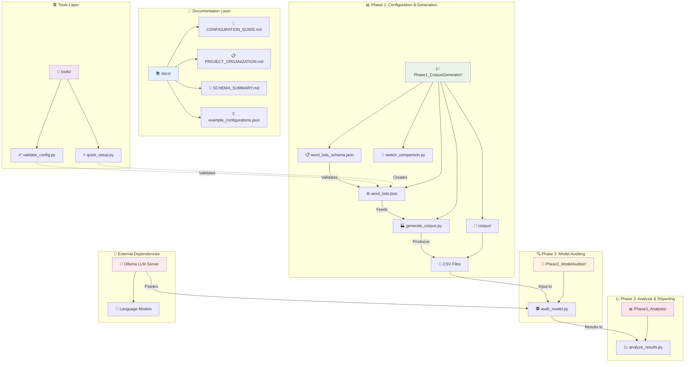

# EquiLens Project Organization

## 🏗️ Architecture Overview

EquiLens follows a modular, phase-based architecture designed for systematic bias auditing:



### 🎯 **Architecture Components Explained**

| Layer               | Purpose                    | Key Components                          | Dependencies           |
| ------------------- | -------------------------- | --------------------------------------- | ---------------------- |
| **📚 Documentation** | User guidance and examples | Configuration guides, schemas, examples | None                   |
| **🛠️ Tools**         | Interactive utilities      | Setup wizard, configuration validator   | Documentation layer    |
| **📊 Phase 1**       | Bias test generation       | Configuration files, corpus generator   | Tools layer            |
| **🔍 Phase 2**       | Model testing              | Audit scripts, bias measurement         | Phase 1 output, Ollama |
| **📈 Phase 3**       | Results analysis           | Statistical analysis, reporting         | Phase 2 output         |
| **🔌 External**      | Language model services    | Ollama server, model instances          | Independent            |

## 🌊 Data Flow Pipeline

The EquiLens framework processes bias testing through a systematic data pipeline:

```mermaid
flowchart LR
    subgraph "📥 Input Stage"
        UserReq[👤 User Requirements<br/>Define bias type to test]
        ConfigStart[⚙️ Configuration Creation<br/>Manual or interactive]
    end

    subgraph "🔧 Configuration Processing"
        JSON[📄 word_lists.json<br/>Bias configuration]
        Validation[✅ Schema Validation<br/>Ensure compliance]
        Switch[🔄 Type Selection<br/>Activate specific bias test]
    end

    subgraph "🏭 Corpus Generation"
        Generator[⚙️ generate_corpus.py<br/>Systematic combination]
        CSV[📊 audit_corpus_*.csv<br/>Test sentences with metadata]
        Stats[📈 Statistics<br/>Combination counts]
    end

    subgraph "🤖 Model Interaction"
        LLM[🧠 Language Model<br/>via Ollama API]
        Audit[🔍 audit_model.py<br/>Bias measurement]
        Responses[💬 Model Responses<br/>with surprisal scores]
    end

    subgraph "📊 Analysis & Output"
        Analysis[📉 analyze_results.py<br/>Statistical processing]
        Reports[📋 Bias Reports<br/>Findings and visualizations]
        Insights[💡 Actionable Insights<br/>Bias patterns identified]
    end

    UserReq --> ConfigStart
    ConfigStart --> JSON
    JSON --> Validation
    Validation --> Switch
    Switch --> Generator
    Generator --> CSV
    Generator --> Stats
    CSV --> Audit
    LLM --> Audit
    Audit --> Responses
    Responses --> Analysis
    Analysis --> Reports
    Reports --> Insights

    style UserReq fill:#e3f2fd
    style JSON fill:#f3e5f5
    style CSV fill:#e8f5e8
    style LLM fill:#fff3e0
    style Reports fill:#fce4ec
    style Insights fill:#e8eaf6
```



### 📋 **Pipeline Stages Explained**

| Stage               | Input             | Process                     | Output                   | Key Metrics         |
| ------------------- | ----------------- | --------------------------- | ------------------------ | ------------------- |
| **📥 Input**         | User requirements | Bias type definition        | Configuration parameters | Scope definition    |
| **🔧 Configuration** | Parameters        | JSON creation & validation  | Valid configuration      | Schema compliance   |
| **🏭 Generation**    | Configuration     | Systematic combinations     | Test corpus (CSV)        | Combination count   |
| **🤖 Model Testing** | Test corpus       | API calls to language model | Response data            | Surprisal scores    |
| **📊 Analysis**      | Response data     | Statistical processing      | Bias reports             | Significance levels |

### **🎯 Data Transformation Examples:**

1. **Configuration → Corpus:**
   ```
   "John" + "engineer" + "analytical" + template
   → "John, the engineer, is known for being very analytical."
   ```

2. **Corpus → Model Response:**
   ```
   Test sentence → Ollama API → Response time & content → Surprisal score
   ```

3. **Responses → Insights:**
   ```
   Multiple surprisal scores → Statistical comparison → Bias measurement
   ```

## 🗂️ Clean File Structure

```
workspace/
├── 📁 docs/                           # Documentation & Examples
│   ├── CONFIGURATION_GUIDE.md         # Detailed setup guide
│   ├── PROJECT_ORGANIZATION.md        # This file
│   ├── SCHEMA_SUMMARY.md              # Complete tool overview
│   ├── example_configurations.json    # Pre-built bias type examples
│   └── ppt.md                         # Project presentation notes
│
├── 📁 tools/                          # Utility Scripts
│   ├── validate_config.py             # Configuration validator
│   └── quick_setup.py                 # Interactive config creator
│
├── 📁 Phase1_CorpusGenerator/         # Corpus Generation
│   ├── word_lists.json                # Main configuration file
│   ├── word_lists_schema.json         # JSON Schema (same location as config)
│   ├── generate_corpus.py             # Corpus generator
│   ├── switch_comparison.py           # Comparison switcher
│   └── 📁 corpus/                     # Generated corpus files
│       ├── audit_corpus_gender_bias.csv
│       ├── audit_corpus_nationality_bias.csv
│       └── audit_corpus_cross_cultural_gender.csv
│
├── 📁 Phase2_ModelAuditor/            # Model Testing
│   └── audit_model.py                 # Model bias auditing
│
├── 📁 Phase3_Analysis/                # Results Analysis
│   └── analyze_results.py             # Bias analysis & visualization
│
├── 📁 .devcontainer/                  # Development Environment
│   ├── devcontainer.json
│   └── docker-compose.yml
│
├── README.md                          # Main documentation
└── requirements.txt                   # Python dependencies
```

## 🎯 Key Organizational Principles

### 1. **Clean Root Directory**
- Only essential files at the root level
- README.md and requirements.txt are the only files developers need immediately
- No scattered configuration or utility files

### 2. **Schema Co-location**
- `word_lists_schema.json` is in the same directory as `word_lists.json`
- This makes it easy to find and maintain the schema alongside the configuration
- Validation tools automatically find the schema in the expected location

### 3. **Documentation Separation**
- All documentation (except README) is in `docs/` directory
- Presentation materials, guides, and examples are properly organized
- Easy to find and maintain documentation

### 4. **Tool Isolation**
- Interactive and utility scripts are in `tools/` directory
- These are NOT executed during Docker builds
- They are developer tools for creating and validating configurations

## 🔧 Tool Usage (Not Auto-Executed)

The tools in the `tools/` directory are **developer utilities** and are **not** executed automatically:

### `tools/quick_setup.py`
- **Purpose**: Interactive configuration creator for developers
- **When to use**: When you want to create a new bias comparison type
- **Execution**: Manual only - `python tools/quick_setup.py`
- **Docker**: Not executed during Docker build

### `tools/validate_config.py`
- **Purpose**: Validate configuration files before use
- **When to use**: Before generating corpus or when debugging configuration issues
- **Execution**: Manual only - `python tools/validate_config.py`
- **Docker**: Not executed during Docker build

## 🐳 Docker Build Process

The Docker container setup (`.devcontainer/`) only:
1. Sets up Python environment
2. Installs packages from `requirements.txt`
3. Configures Ollama service
4. **Does NOT run any tools automatically**

## 📝 Usage Workflow

### For New Users:
```bash
# 1. Create configuration (optional - defaults exist)
python tools/quick_setup.py

# 2. Validate configuration
python tools/validate_config.py

# 3. Generate corpus
cd Phase1_CorpusGenerator
python generate_corpus.py
```

### For Existing Configurations:
```bash
# Just generate and use
cd Phase1_CorpusGenerator
python generate_corpus.py
```

## 🎉 Benefits of This Organization

1. **Clean Root**: Only essential files visible at first glance
2. **Logical Grouping**: Related files are together
3. **No Confusion**: Clear separation between docs, tools, and phases
4. **Schema Co-location**: Configuration and schema are together
5. **Professional**: Follows standard open-source project structure
6. **Docker-Safe**: No unexpected tool execution during builds
