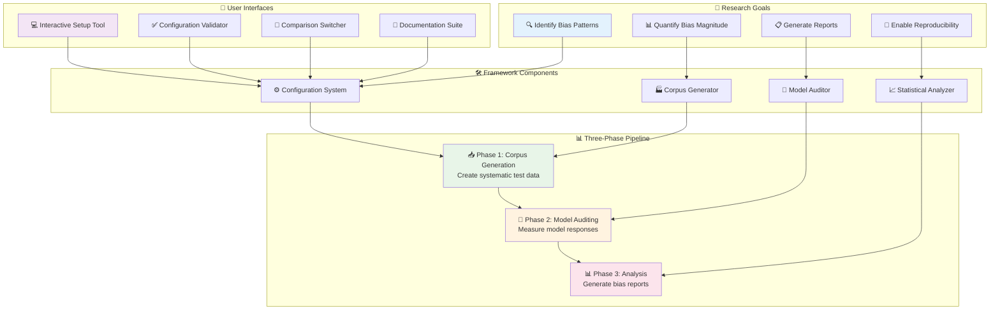
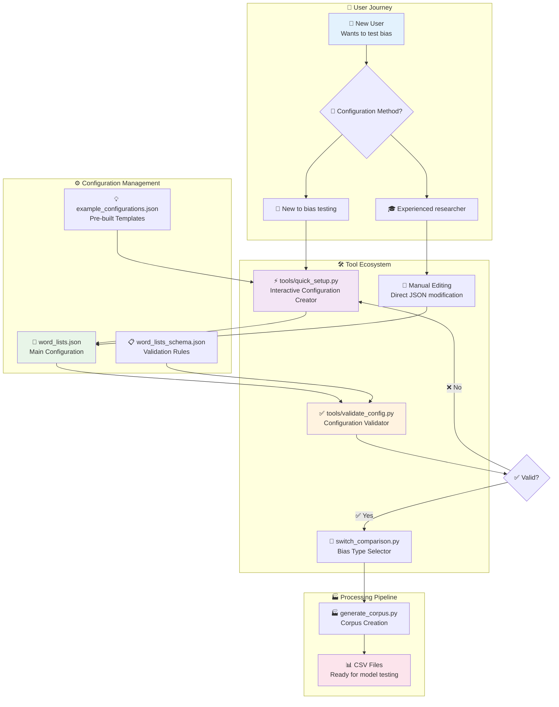
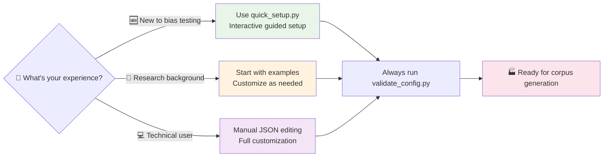

# EquiLens Schema & Tool Summary

## 🎯 Complete Framework Overview

EquiLens is a comprehensive bias auditing framework for SLMs/LLMs with three distinct phases and a robust configuration system.

## 🏛️ Framework Architecture

The EquiLens framework follows a systematic, research-grade approach to bias detection:



### 🔍 **Framework Principles Explained**

| Principle                      | Implementation                                  | Benefit                                        |
| ------------------------------ | ----------------------------------------------- | ---------------------------------------------- |
| **🔄 Reproducibility**          | JSON-based configuration with schema validation | Consistent results across runs and researchers |
| **🎯 Systematic Testing**       | Cartesian product of all test variables         | Comprehensive bias coverage                    |
| **📊 Quantitative Measurement** | Surprisal-based scoring methodology             | Objective bias quantification                  |
| **🛠️ User-Friendly**            | Interactive tools and guided setup              | Accessible to non-programmers                  |
| **📈 Scalable**                 | Configurable test complexity                    | From small pilots to large studies             |
| **🎨 Modular**                  | Phase-based architecture                        | Easy integration and customization             |

---

## 📁 Project Structure

### Core Directories
```
workspace/
├── 📁 docs/                    # All documentation & examples
├── 📁 tools/                   # Interactive utilities
├── 📁 Phase1_CorpusGenerator/  # Bias corpus generation
├── 📁 Phase2_ModelAuditor/     # Model bias testing
├── 📁 Phase3_Analysis/         # Results analysis
└── 📁 .devcontainer/          # Docker development environment
```

### Essential Files
- `README.md` - Main project documentation
- `requirements.txt` - Python dependencies
- `Phase1_CorpusGenerator/word_lists.json` - Main configuration
- `Phase1_CorpusGenerator/word_lists_schema.json` - JSON Schema

---

## 🔧 Interactive Tools

The EquiLens framework provides comprehensive tooling for bias test creation and management:



### 🛠️ **Tool Functions Explained**

| Tool                       | Primary Function                   | User Type              | Key Features                         |
| -------------------------- | ---------------------------------- | ---------------------- | ------------------------------------ |
| **⚡ quick_setup.py**       | Interactive configuration creation | Beginners, researchers | Guided prompts, validation, examples |
| **✅ validate_config.py**   | Configuration quality assurance    | All users              | Schema checking, error reporting     |
| **📝 Manual Editing**       | Direct JSON modification           | Advanced users         | Full control, schema reference       |
| **🔄 switch_comparison.py** | Bias type selection                | All users              | Easy switching between test types    |
| **💡 Examples**             | Pre-built configurations           | Learning users         | Ready-to-use bias tests              |

### **🎯 Tool Selection Guide:**



### **⚡ Quick Setup Tool**

### 1. Configuration Creator (`tools/quick_setup.py`)
**Purpose**: Interactive bias type configuration creator

**Features**:
- ✅ Guided bias type creation
- ✅ Template builder with validation
- ✅ Word list management
- ✅ Real-time schema validation
- ✅ JSON output generation

**Usage**:
```bash
python tools/quick_setup.py
```

**Output**: Updates `Phase1_CorpusGenerator/word_lists.json`

### 2. Configuration Validator (`tools/validate_config.py`)
**Purpose**: Comprehensive configuration validation

**Features**:
- ✅ JSON Schema compliance checking
- ✅ Detailed error reporting
- ✅ Template placeholder validation
- ✅ Word list completeness verification
- ✅ Statistical analysis recommendations

**Usage**:
```bash
python tools/validate_config.py
```

**Output**: Detailed validation report with specific error locations

---

## 📋 JSON Schema System

### Schema Location
- **File**: `Phase1_CorpusGenerator/word_lists_schema.json`
- **Co-located**: Same directory as configuration file for easy maintenance

### Schema Features

#### Required Structure
```json
{
  "bias_comparisons": {
    "bias_type_name": {
      "description": "string (required)",
      "word_lists": {
        "group_name": ["array of strings (min 1 item)"]
      },
      "templates": ["array of strings with {PLACEHOLDER}"]
    }
  }
}
```

#### Validation Rules
- ✅ **Minimum Groups**: 2 word list groups per bias type
- ✅ **Template Validation**: Must contain `{PLACEHOLDER}` marker
- ✅ **Non-Empty Requirements**: All arrays must have at least 1 item
- ✅ **String Validation**: All text fields must be non-empty strings
- ✅ **Structure Validation**: Proper nesting and field names

#### Advanced Validation
- **Word List Balance**: Recommends similar group sizes
- **Template Variety**: Suggests diverse context coverage
- **Placeholder Check**: Ensures proper template substitution markers

---

## 🎨 Supported Bias Types

### Pre-configured Types

#### 1. Gender Bias
```json
"gender_bias": {
  "word_lists": {
    "male_terms": ["man", "male", "he", "him"],
    "female_terms": ["woman", "female", "she", "her"]
  }
}
```

#### 2. Cross-Cultural Gender
```json
"cross_cultural_gender": {
  "word_lists": {
    "western_male": ["John", "Michael", "man"],
    "western_female": ["Sarah", "Emily", "woman"],
    "eastern_male": ["Raj", "Hiroshi", "man"],
    "eastern_female": ["Priya", "Yuki", "woman"]
  }
}
```

#### 3. Nationality Bias
```json
"nationality_bias": {
  "word_lists": {
    "western_names": ["American", "British", "Canadian"],
    "asian_names": ["Chinese", "Japanese", "Indian"],
    "african_names": ["Nigerian", "South African", "Kenyan"]
  }
}
```

### Custom Bias Types
The framework supports unlimited custom bias types following the same schema structure.

---

## 🔄 Phase-by-Phase Workflow

### Phase 1: Corpus Generation
**Files**: `Phase1_CorpusGenerator/`

1. **Configure**: Use `tools/quick_setup.py` or edit `word_lists.json`
2. **Validate**: Run `tools/validate_config.py`
3. **Generate**: Execute `generate_corpus.py`
4. **Switch**: Use `switch_comparison.py` to change active bias types

**Output**: Corpus files saved to `Phase1_CorpusGenerator/corpus/`

### Phase 2: Model Auditing
**Files**: `Phase2_ModelAuditor/`

1. **Setup**: Ensure Ollama is running with target model
2. **Audit**: Run `audit_model.py` with generated corpus
3. **Monitor**: Track model responses and surprisal scores

**Output**: Model response data with bias measurements

### Phase 3: Analysis & Visualization
**Files**: `Phase3_Analysis/`

1. **Analyze**: Run `analyze_results.py` on audit outputs
2. **Visualize**: Generate bias analysis charts and reports
3. **Export**: Save analysis results and visualizations

**Output**: Comprehensive bias analysis reports

---

## 📊 Scaling Capabilities

### Small-Scale Testing
- **Word Lists**: 5-10 words per group
- **Templates**: 10-20 templates
- **Combinations**: ~1,000-10,000 test cases

### Large-Scale Research
- **Word Lists**: 20-50 words per group
- **Templates**: 50-100 templates
- **Combinations**: 1,000,000+ test cases

### Enterprise-Level
- **Word Lists**: 100+ words per group
- **Templates**: 200+ templates
- **Combinations**: Unlimited (resource-dependent)

---

## 🛠️ Development Environment

### Docker Container
- **Base**: Python 3.12 on Debian
- **Services**: Ollama for local LLM hosting
- **Packages**: pandas, numpy, requests, matplotlib, seaborn, tqdm
- **Auto-setup**: Installs requirements.txt on container start

### Development Workflow
1. **Container Start**: Automatic Python environment setup
2. **Tool Usage**: Manual execution of interactive tools
3. **Validation**: Continuous schema checking
4. **Testing**: Iterative corpus generation and validation

---

## 🎯 Key Benefits

### Modularity
- ✅ Add new bias types without code changes
- ✅ Swap configurations instantly
- ✅ Independent tool execution

### Validation
- ✅ Real-time schema checking
- ✅ Detailed error reporting
- ✅ Interactive correction guidance

### Scalability
- ✅ Handle millions of test combinations
- ✅ Configurable resource usage
- ✅ Batch processing support

### Research-Ready
- ✅ Academic publication quality
- ✅ Reproducible configurations
- ✅ Comprehensive documentation

### Professional Organization
- ✅ Clean directory structure
- ✅ Logical file grouping
- ✅ Industry-standard practices

---

## 🚀 Quick Start Commands

```bash
# 1. Create new bias type configuration
python tools/quick_setup.py

# 2. Validate configuration
python tools/validate_config.py

# 3. Generate corpus
cd Phase1_CorpusGenerator
python generate_corpus.py

# 4. Switch between bias types
python switch_comparison.py

# 5. Audit model (requires Ollama)
cd ../Phase2_ModelAuditor
python audit_model.py

# 6. Analyze results
cd ../Phase3_Analysis
python analyze_results.py
```

This framework provides a complete, professional-grade bias auditing system suitable for academic research, industry applications, and open-source contributions.
