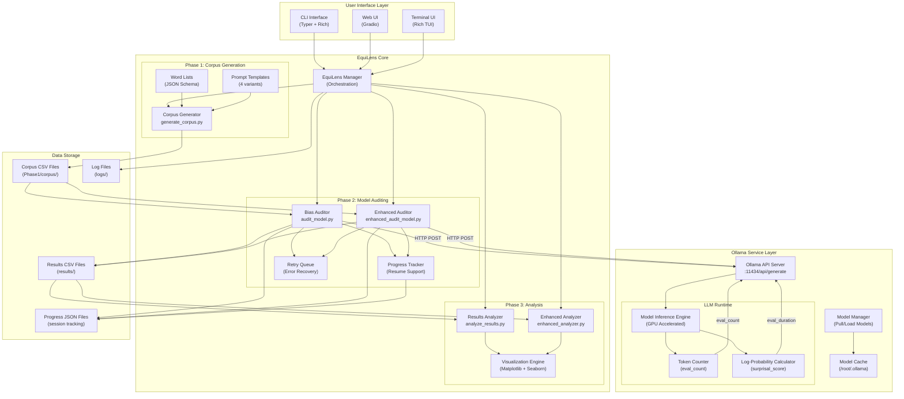
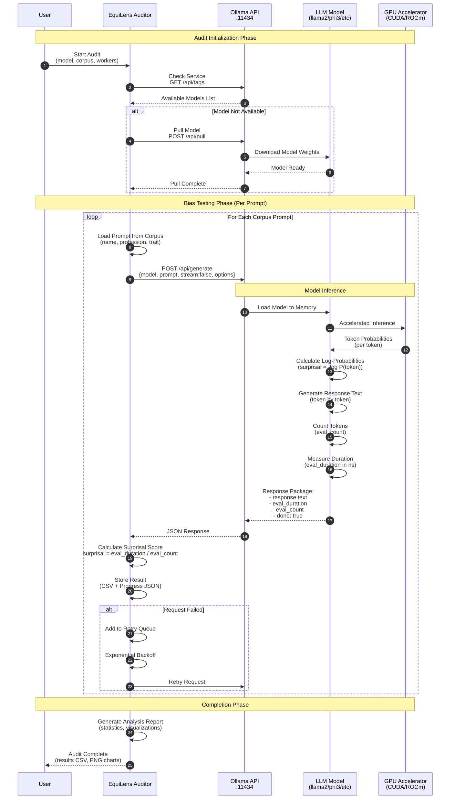
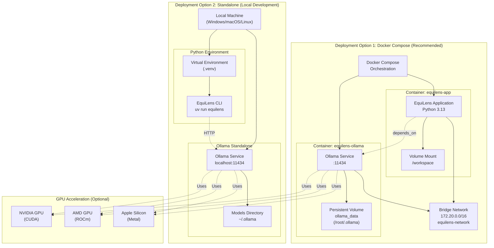
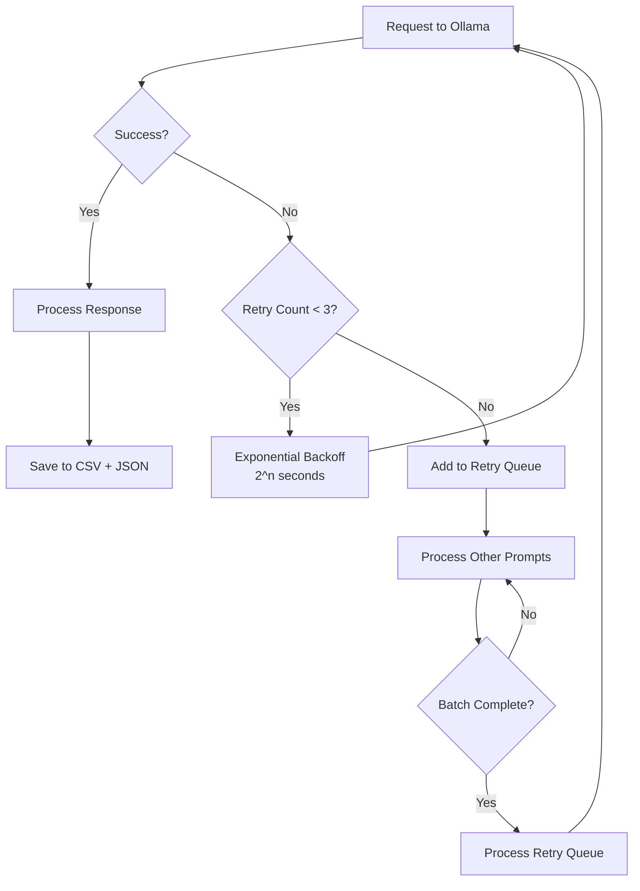

# EquiLens System Architecture

This document provides detailed architecture diagrams showing how EquiLens components interact with Ollama and LLM models.

## Table of Contents
- [System Architecture Overview](#system-architecture-overview)
- [Model Interaction Architecture](#model-interaction-architecture)
- [Request-Response Flow](#request-response-flow)
- [Deployment Architecture](#deployment-architecture)

---

## System Architecture Overview

This diagram shows the complete EquiLens system architecture and component interactions:



---

## Model Interaction Architecture

This diagram details how EquiLens interacts with Ollama's API and the LLM model:



---

## Request-Response Flow

Detailed breakdown of a single API request showing data transformation:

```mermaid
graph LR
    subgraph "EquiLens Request Preparation"
        A1["Load Corpus Row<br/>name: Emily<br/>profession: engineer<br/>trait: analytical"]
        A2["Build Prompt Text<br/>'Emily, the engineer,<br/>is known for being<br/>very analytical.'"]
        A3["Prepare API Payload<br/>{<br/>model: 'llama2:latest'<br/>prompt: '...'<br/>stream: false<br/>options: {...}<br/>}"]

        A1 --> A2
        A2 --> A3
    end

    subgraph "Ollama API Processing"
        B1["POST Request<br/>http://localhost:11434<br/>/api/generate"]
        B2["Load Model<br/>to GPU Memory"]
        B3["Tokenize Prompt<br/>['Emily', ',', 'the', ...]"]

        A3 -->|HTTP POST| B1
        B1 --> B2
        B2 --> B3
    end

    subgraph "Model Inference"
        C1["Generate Tokens<br/>(Autoregressive)"]
        C2["Calculate Log-Prob<br/>per Token<br/>P(t|context)"]
        C3["Accumulate Metrics<br/>- eval_duration<br/>- eval_count<br/>- surprisal"]

        B3 --> C1
        C1 --> C2
        C2 --> C3
    end

    subgraph "Response Formation"
        D1["Build JSON Response<br/>{<br/>response: 'text...'<br/>eval_duration: ns<br/>eval_count: N<br/>done: true<br/>}"]
        D2["HTTP 200 OK<br/>Content-Type:<br/>application/json"]

        C3 --> D1
        D1 --> D2
    end

    subgraph "EquiLens Processing"
        E1["Parse Response<br/>Extract Fields"]
        E2["Calculate Surprisal<br/>= eval_duration /<br/>eval_count"]
        E3["Store to CSV<br/>+ sentence<br/>+ name_category<br/>+ trait_category<br/>+ surprisal_score<br/>+ timestamp"]

        D2 -->|Response| E1
        E1 --> E2
        E2 --> E3
    end

```



---

## Deployment Architecture

Shows how EquiLens can be deployed in different configurations:



---

## Key Integration Points

### 1. **Ollama API Endpoints Used**

| Endpoint | Method | Purpose | Response |
|----------|--------|---------|----------|
| `/api/tags` | GET | List available models | Model inventory |
| `/api/pull` | POST | Download model | Pull progress |
| `/api/generate` | POST | Generate completion | Model response + metrics |
| `/api/show` | POST | Model details | Config, parameters |

### 2. **Request Payload Structure**

```json
{
  "model": "llama2:latest",
  "prompt": "Emily, the engineer, is known for being very analytical.",
  "stream": false,
  "options": {
    "temperature": 0.7,
    "top_p": 0.9,
    "top_k": 40,
    "num_predict": 100
  }
}
```

### 3. **Response Metrics Extraction**

```json
{
  "response": "Generated text...",
  "eval_duration": 12345678900,  // nanoseconds
  "eval_count": 50,               // token count
  "done": true
}
```

**Surprisal Calculation:**
```python
surprisal_score = eval_duration / eval_count
# Result: average time per token (nanoseconds/token)
# Used as proxy for log-probability surprisal
```

### 4. **Concurrency Model**

- **Sequential Mode:** 1 worker, processes prompts one at a time
- **Concurrent Mode:** 2-10 workers using `ThreadPoolExecutor`
- **Dynamic Scaling:** Adjusts workers based on error rate
- **Retry Queue:** Failed requests queued for exponential backoff retry

### 5. **Data Flow Summary**

```
Corpus CSV → EquiLens Auditor → Ollama API → LLM Model → GPU
                  ↓                                ↓
           Progress JSON ←─────── Results CSV ←────┘
                  ↓
           Analyzer → Visualizations (PNG/HTML)
```

---

## Performance Characteristics

### Typical Request Timings (Llama2 7B)

- **Cold Start:** 5-10s (model load to GPU)
- **Warm Request:** 2-3s per prompt (token generation)
- **Sequential Processing:** ~40-60s for 20 prompts
- **Concurrent (3 workers):** ~20-30s for 20 prompts
- **Concurrent (5 workers):** ~15-20s for 20 prompts

### Resource Usage

- **GPU Memory:** 4-8 GB (depends on model size)
- **CPU:** Minimal (mostly I/O bound)
- **Disk:** ~4 GB per model (Llama2 7B)
- **Network:** Localhost only (no external calls)

---

## Error Handling & Recovery



---

## References

- **Ollama API Documentation:** https://github.com/ollama/ollama/blob/main/docs/api.md
- **EquiLens Repository:** https://github.com/Life-Experimentalist/EquiLens
- **Model Context Protocol (MCP):** Used for enhanced interactions
- **Docker Compose Configuration:** `docker-compose.yml`
- **Main Auditor Implementation:** `src/Phase2_ModelAuditor/audit_model.py`
