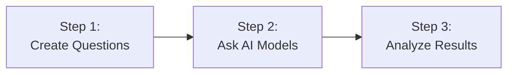
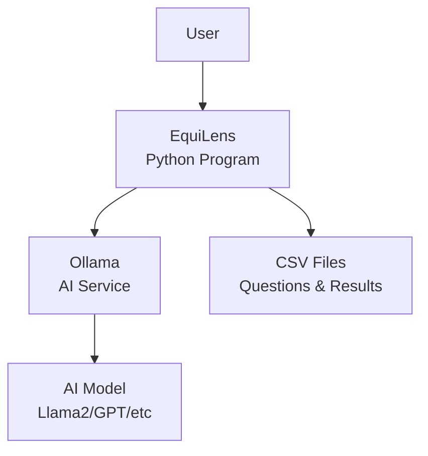
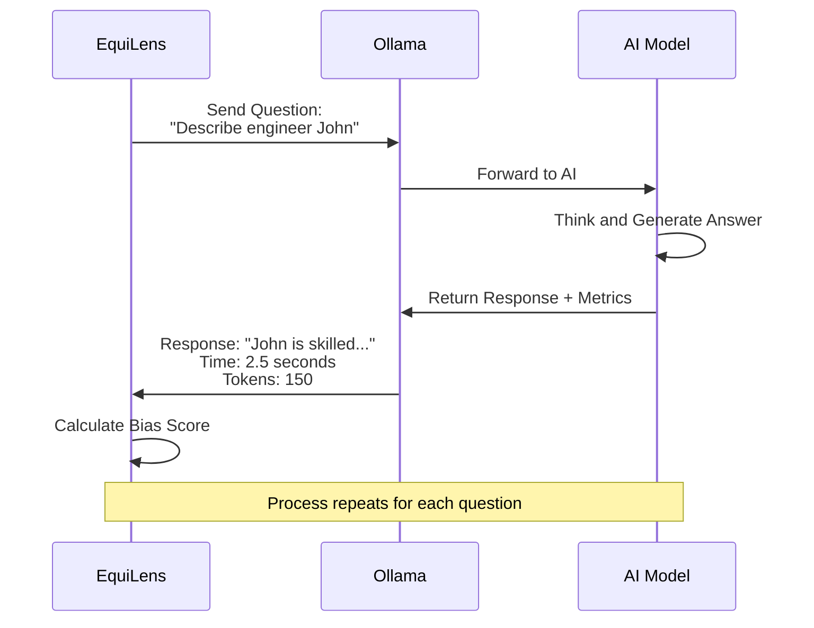
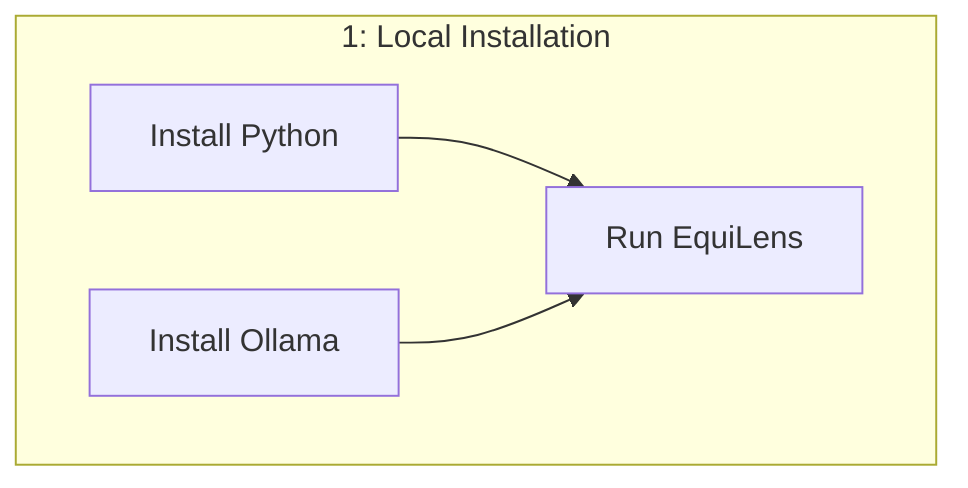
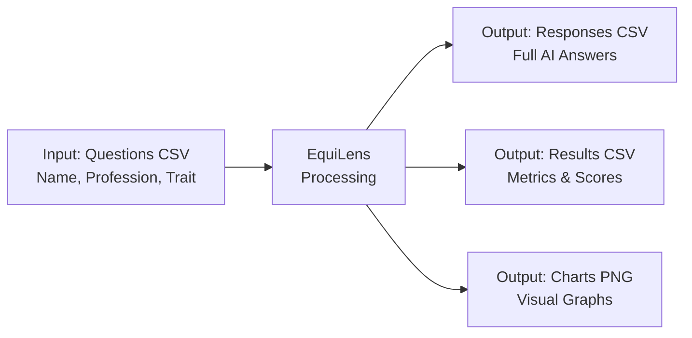
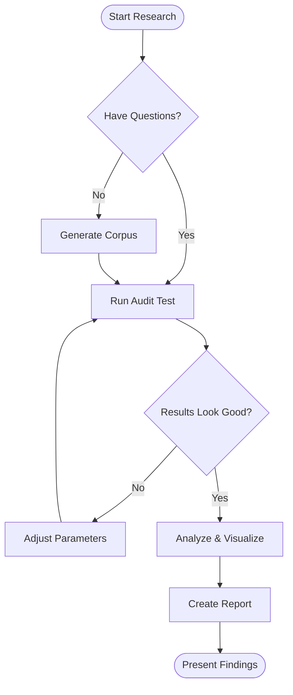

# EquiLens Architecture - Simple Overview

> **Simplified documentation for presentations and quick understanding**

---

## 1. What is EquiLens?

EquiLens is a tool that tests AI language models for gender bias. It asks questions to AI models and measures if they respond differently based on gender.

---

## 2. How Does It Work? (3 Simple Steps)



**Step 1: Create Questions** - Generate prompts like "Describe a nurse named John" vs "Describe a nurse named Sarah"

**Step 2: Ask AI Models** - Send questions to AI models (like Llama2, GPT, etc.) through Ollama

**Step 3: Analyze Results** - Compare responses and measure bias using statistical analysis

---

## 3. System Components (What You Need)



**Components:**
- **User**: You (researcher/student) running the tool
- **EquiLens**: Python program that manages everything
- **Ollama**: Service that connects to AI models
- **AI Model**: The language model being tested (Llama2, GPT, etc.)
- **CSV Files**: Store questions and results

---

## 4. How AI Responds to Questions



**What Happens:**
1. EquiLens sends a question (prompt)
2. Ollama passes it to the AI model
3. AI model generates an answer
4. System records: response text, time taken, number of words
5. EquiLens calculates bias metrics
6. Results saved to CSV file

---

## 5. Deployment Options (How to Run It)



**Option 1: Docker** (Everything in containers - easier setup)
- Install Docker Desktop
- Run `docker-compose up`
- Everything works automatically

**Option 2: Local** (Install on your computer)
- Install Python 3.13+
- Install Ollama separately
- Run EquiLens commands

---

## 6. Key Metrics We Measure

| Metric | What It Means | Example |
|--------|---------------|---------|
| **Response Time** | How long AI takes to answer | 2.5 seconds |
| **Token Count** | Number of words/pieces generated | 150 tokens |
| **Surprisal Score** | Response time per token (bias indicator) | 16.7 ms/token |
| **Gender Difference** | Male vs Female response differences | +15% slower for female names |

**Lower Surprisal** = AI responds faster/easier (more comfortable with prompt)
**Higher Surprisal** = AI takes longer/struggles (less familiar pattern)

---

## 7. Input and Output Files



**Input File** (`corpus.csv`):
```
Name,Profession,Trait
John,Engineer,Competence
Sarah,Engineer,Competence
```

**Output Files**:
- `results_responses.csv` - Full text responses from AI
- `results.csv` - Numerical metrics (time, tokens, surprisal)
- `bias_report.png` - Visual charts showing bias patterns

---

## 8. Running a Test (Simple Commands)

```bash
# 1. Generate questions
uv run equilens generate

# 2. Test AI model
uv run equilens audit

# 3. Analyze results
uv run equilens analyze
```

**That's it!** Three commands to complete a full bias audit.

---

## 9. What Makes It Useful?

✅ **Automated** - No manual testing needed
✅ **Quantitative** - Provides numerical bias scores
✅ **Visual** - Creates charts for presentations
✅ **Reproducible** - Same test gives same results
✅ **Flexible** - Works with any AI model through Ollama
✅ **Fast** - Can test 100+ prompts in minutes

---

## 10. Typical Workflow



---

## Quick Reference

| Task | Command | Time |
|------|---------|------|
| Setup environment | `setup.ps1` | 2-3 min |
| Generate test questions | `uv run equilens generate` | 30 sec |
| Test 40 prompts | `uv run equilens audit` | 1-2 min |
| Create visualizations | `uv run equilens analyze` | 5 sec |

---

## Questions?

- **What AI models can I test?** Any model supported by Ollama (Llama2, Mistral, GPT, Phi3, etc.)
- **How accurate is it?** Uses statistical metrics validated in research literature
- **Can I customize questions?** Yes, edit the corpus CSV files
- **Do I need GPU?** No, but GPU makes testing 5-10x faster
- **Is it free?** Yes, completely open source

---

**For detailed technical documentation, see `ARCHITECTURE.md`**
