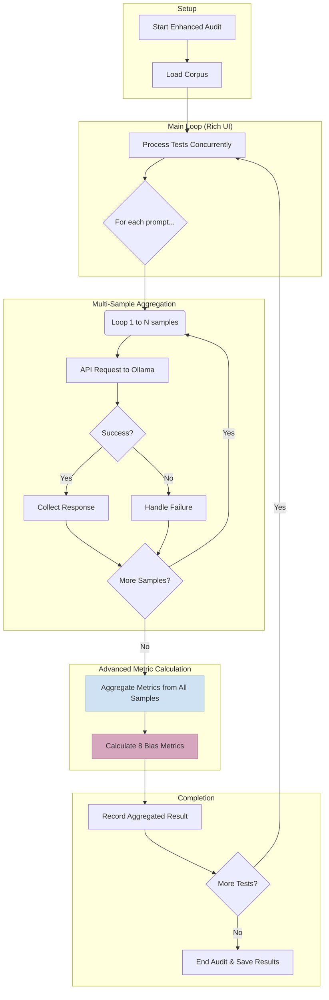

# EquiLens Auditing Mechanisms: A Deep Dive

**October 15, 2025**

## 1. Executive Summary

The EquiLens platform employs a sophisticated **dual-auditor architecture** within its `Phase2_ModelAuditor` module. This design provides both a **stable, production-grade auditor** for reliable, large-scale bias detection and an **experimental, feature-rich auditor** for advanced research and metric exploration.

This document details the inner workings of both auditors, their specific use cases, and their core technical features.

- **`audit_model.py` (Standard Auditor):** The default, battle-tested engine focused on reliability, resumability, and robust error handling. **This is the recommended auditor for all production tasks.**
- **`enhanced_audit_model.py` (Enhanced Auditor):** An optional, experimental engine that introduces advanced features like multi-metric analysis, multi-sample aggregation, and a rich user interface.

Both auditors are fully functional and produce compatible outputs for seamless integration with the Phase 3 analysis pipeline.

---

## 2. The Standard Auditor (`audit_model.py`)

The Standard Auditor is the workhorse of the EquiLens platform. It is engineered for stability and resilience during long-running audit processes.

**Primary Use Cases:**
- Production bias audits.
- Large-scale corpus processing (1,000 to 1,000,000+ prompts).
- Environments with potentially unstable network connections.
- Any scenario where reliability and data integrity are the top priorities.

### Workflow Diagram

```mermaid
flowchart TD
    subgraph "Setup"
        A[Start Audit] --> B{Load Corpus};
        B --> B1(Check for Resume File);
    end

    subgraph "Main Loop (Concurrent)"
        B1 --> C[Process Tests w/ ThreadPoolExecutor];
        C --> D{Make API Request};
    end

    subgraph "Response Handling"
        D --> E{Request Successful?};
        E -- Yes --> F[Record Result & Update ETA];
        F --> G{More Tests?};
        G -- Yes --> C;
    end

    subgraph "Error & Retry Logic"
        E -- No --> H{Immediate Retry? (Attempt 1/3)};
        H -- Yes --> D;
        H -- No --> I{Add to Retry Queue};
        I --> G;
    end

    subgraph "Completion"
        G -- No --> J{Retry Queue Not Empty?};
        J -- Yes --> K[Process Retry Queue Batch];
        K --> C;
        J -- No --> L[Save Final Results & Summary];
        L --> M[End Audit];
    end

    style F fill:#d4edda,stroke:#c3e6cb
    style I fill:#f8d7da,stroke:#f5c6cb
    style K fill:#fff3cd,stroke:#ffeeba
```

### Core Features Explained

#### a. Production-Grade Error Handling
The auditor is designed to survive real-world failures.
- **Exponential Backoff:** For transient API errors, the auditor waits before retrying, increasing the delay with each failed attempt (e.g., 1s, 2s, 4s, up to 60s) to avoid overwhelming the server.
- **Retry Queue:** Tests that fail consistently are moved to a `retry_queue`. This queue is processed in batches after a certain number of successful tests have completed, giving the system time to recover.
- **Multi-Host Fallback:** It automatically tries to connect to Ollama via multiple endpoints (`ollama:11434`, `localhost:11434`), making it robust in different Docker and local environments.

#### b. Dynamic Concurrency Scaling
To maximize performance without sacrificing stability, the auditor dynamically adjusts its level of concurrency.
- **Starts** with the user-defined number of workers (`--max-workers`).
- **Scales Down:** If it detects 3 consecutive API failures, it reduces the number of concurrent workers to ease the load on the model server.
- **Scales Up:** After 10 consecutive successful requests, it restores the number of workers, demonstrating self-healing capabilities.

#### c. Resumable Sessions
Long-running audits can be interrupted. The Standard Auditor handles this gracefully.
- **Progress Tracking:** It periodically saves its state (which tests are done, which are in the retry queue) to a `progress_{session_id}.json` file.
- **Seamless Resume:** By running the audit command with the `--resume` flag pointing to this file, the audit will continue exactly where it left off, preventing data loss and wasted computation.

---

## 3. The Enhanced Auditor (`enhanced_audit_model.py`)

The Enhanced Auditor is a laboratory for cutting-edge bias detection techniques. It is designed for researchers who need deeper insights and are willing to trade some stability for more powerful features.

**Primary Use Cases:**
- Academic research and experimentation.
- Exploring complex bias signals beyond simple response generation.
- Validating model behavior with statistical robustness (multi-sample).
- Interactive analysis where visual feedback is helpful.

### Workflow Diagram



### Advanced Features Explained

#### a. Multi-Metric Analysis
Where the standard auditor focuses on one primary bias metric, the enhanced version calculates **eight distinct metrics** for a more holistic view:
1.  **Surprisal Score:** The original perplexity-based metric.
2.  **Normalized Surprisal:** Adjusts for token count.
3.  **Token Count:** Raw token count of the response.
4.  **Response Length:** Character count of the response.
5.  **Sentiment Score:** A numeric score from -1 (negative) to +1 (positive).
6.  **Polarity:** A categorical label (`positive`, `neutral`, `negative`).
7.  **Confidence Estimate:** Extracted from structured JSON output.
8.  **Parsing Success:** Measures how often the model successfully returns valid JSON.

#### b. Multi-Sample Aggregation
To reduce the noise from single-response variance, this auditor can request the same prompt multiple times (1-5 samples). It then aggregates the results, typically using the **median** value, to produce a more statistically stable and reliable bias measurement. This is configured with the `samples_per_prompt` parameter.

#### c. Structured Output Support
This feature instructs the model to return its answer in a JSON format. This is a powerful technique for two reasons:
- **Reliable Data Extraction:** It makes parsing answers (like a confidence score) trivial.
- **Metacognitive Analysis:** It allows the auditor to test if the *act of forcing structured output* itself introduces or mitigates bias.

#### d. Rich User Interface
Leveraging the `rich` library, this auditor provides a live, in-terminal dashboard showing:
- Detailed progress bars for each concurrent worker.
- Real-time statistics on completion rates, ETA, and errors.
- Color-coded status indicators for a clear visual overview.

---

## 4. Quick Reference & Comparison

| Feature | Standard Auditor (Fallback) | Enhanced Auditor (Default) |
| :--- | :--- | :--- |
| **Status** | ✅ **Production-Ready** | ✅ **Default with Auto-Fallback** |
| **Primary Use** | Reliable fallback for errors | Fast, dynamic concurrency audits |
| **Error Handling** | **Superior:** Retry Queue, Backoff | **Good:** Auto-fallback to standard on error |
| **Concurrency** | Sequential or fixed workers | **Dynamic:** Batch processing (default: 5) |
| **Resumability** | ✅ **Yes** | ✅ **Yes** |
| **Bias Metrics** | 1 (Surprisal-based) | 1 (Surprisal-based, extensible) |
| **UI** | Standard print statements | **Rich** interactive progress bars |
| **CLI Command** | `uv run equilens audit --no-enhanced ...` | `uv run equilens audit ...` (default) |

### Conclusion

The dual-auditor architecture is a core strength of EquiLens. The **Enhanced Auditor** is now the default, providing dynamic concurrency and better UX with automatic fallback to the **Standard Auditor** if any issues occur, ensuring reliability without sacrificing performance.
